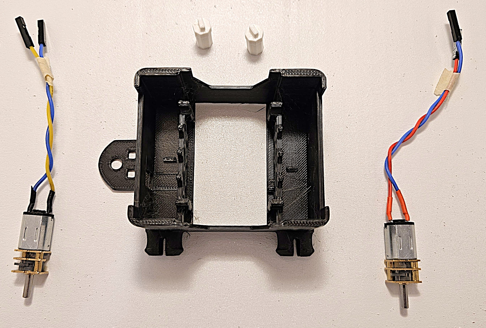
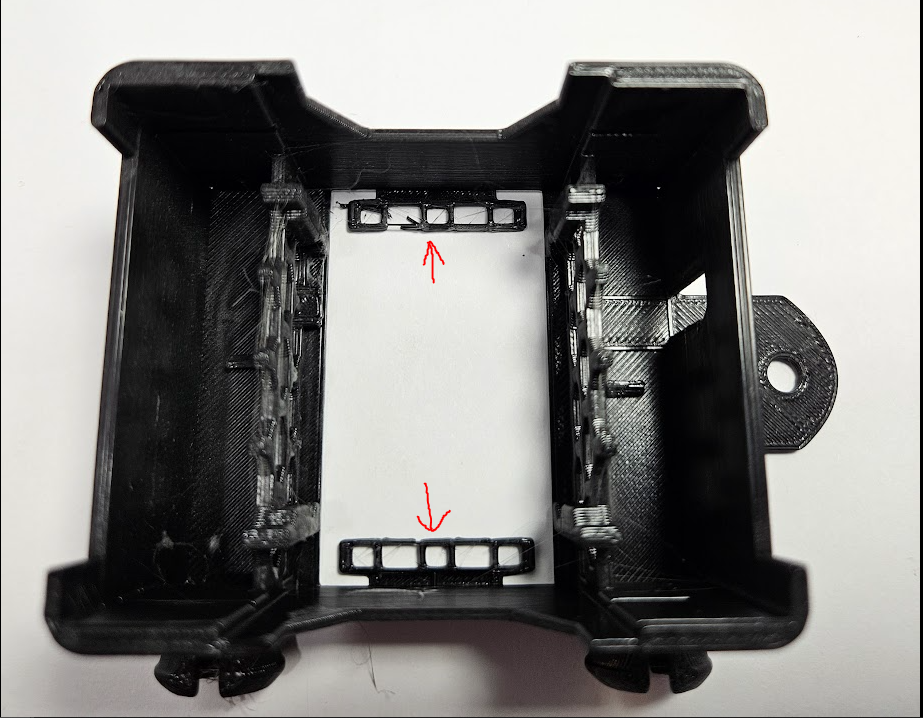
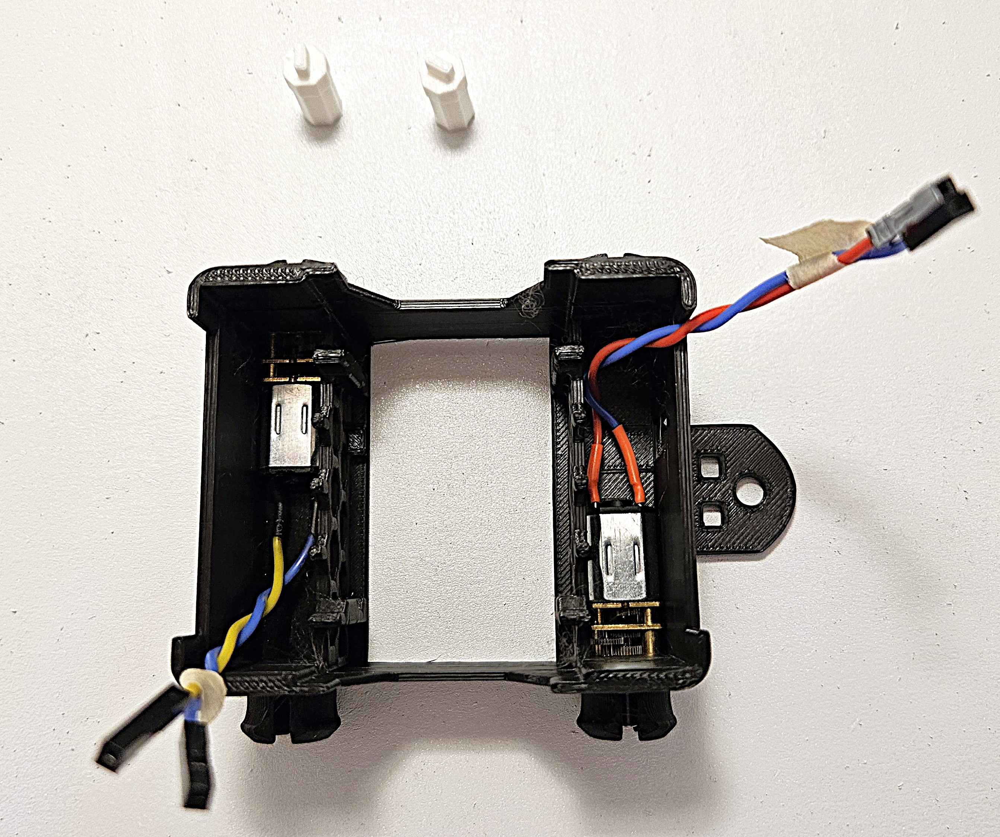
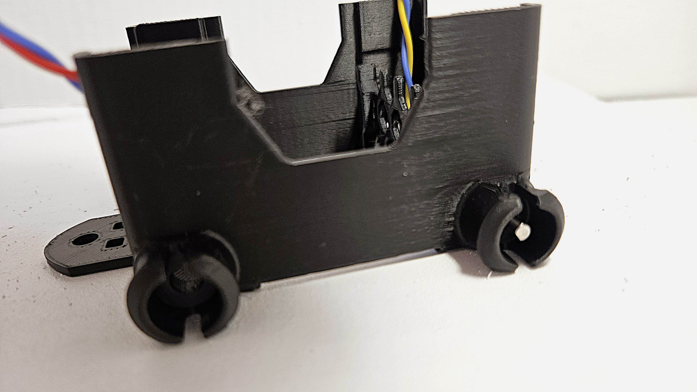
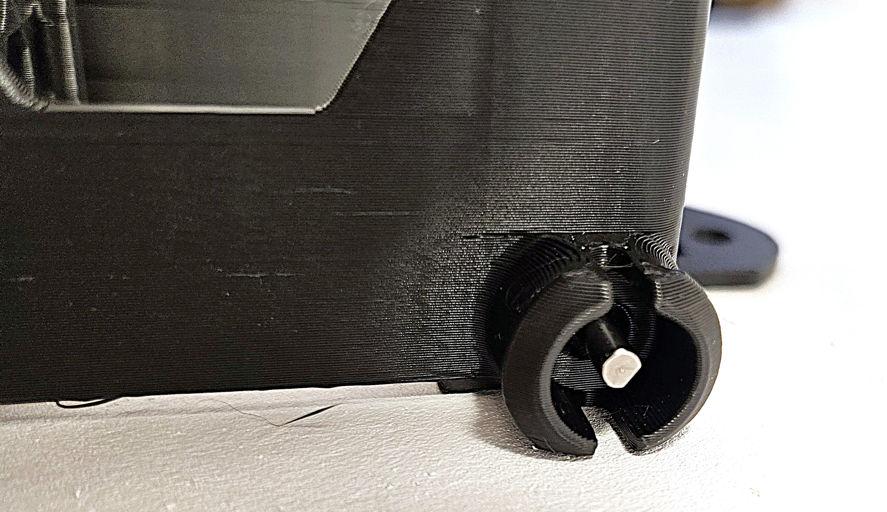
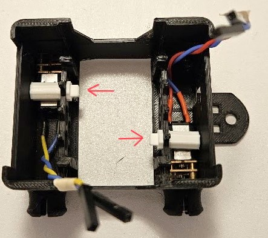
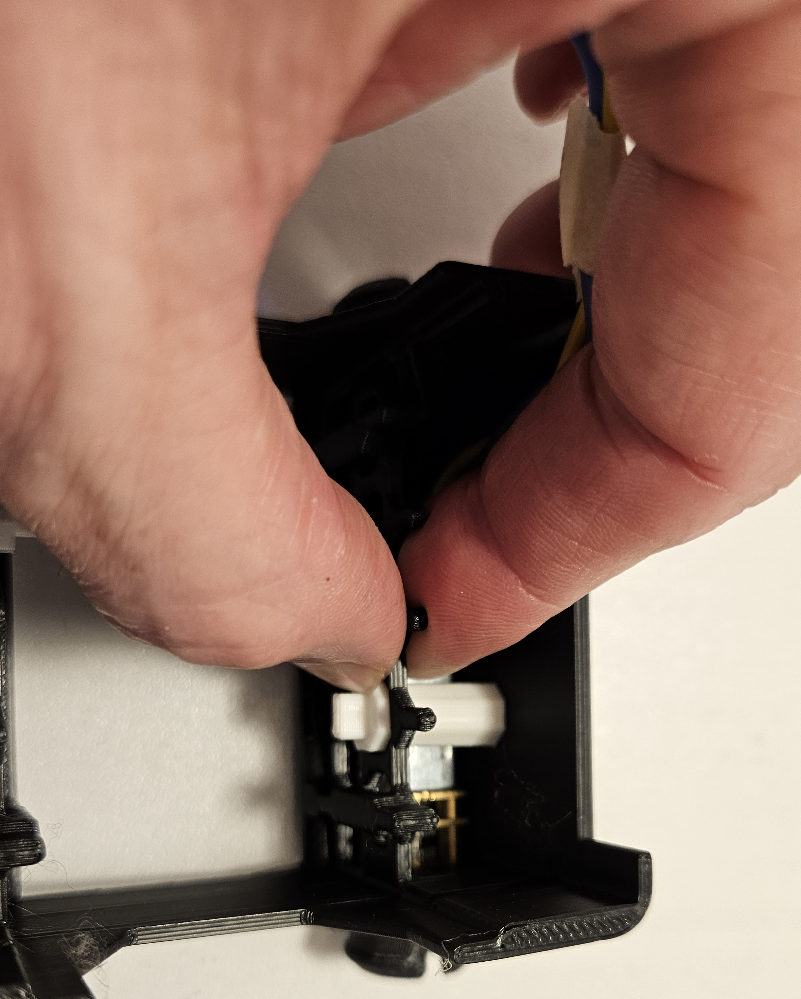

# Chassis Assembly

### Parts

- Chassis
- 2 motors
- 2 hex plugs

### Remove tabs

There may be two tabs attached to the inside bottom of your chassis.  If they are on your chassis, remove them.  They should easily bend and snap off with little effort. They are not needed. 

### Add Motors

Orient the chassis with the "hitch" to the right (see picture below).
The motors have a flat top and bottom and rounded sides.  When inserting the motors, a flat side should rest against the bottom of the chassis so that the wires are horizontal.
Insert one motor into the top left and one into the bottom right.  Make sure the shaft extends out of the chassis as much as possible.  
There is a small tab on the floor of the chassis behind each motor.  Make sure the motor is pushed in so that the tab is behind the motor.

If the motor is installed properly the shaft or axle should extend out almost as far as the wheel hubs on the chassis.

Notice that the axle should protrude almost to the edge of the wheel hub on the chassis if installed correctly.

With the motors installed, take your hex plugs and slide them into the hex hole above the back of each motor.  Be sure to orient the hex plugs so they match the shape of the hole in the chassis and the tab on the end of the hex plug is horizontal.  Push the hex plug into place so that the fatter end of the hex plug is wedged into the chassis. 

To snap them into place, it's recommended to use a pinching motion with your thumbs on the hex plug and your fingers on the outside of the lattice structure they go through.  The picture below shows using one hand, but two hands are better.

 If the hex plugs do not fit super snugly, it's ok.  The hex plugs just help keep the motors in position while you put on the wheels and transmission pieces.  The hex plugs are optional and if they are not fitting well you can leave them out.

Once the motors are securely in place you are done with this step!

[back](https://github.com/javaplus/MadScientist/blob/main/lessons/assembly/plate.md)

[next](https://github.com/javaplus/MadScientist/blob/main/lessons/assembly/wheels.md)
