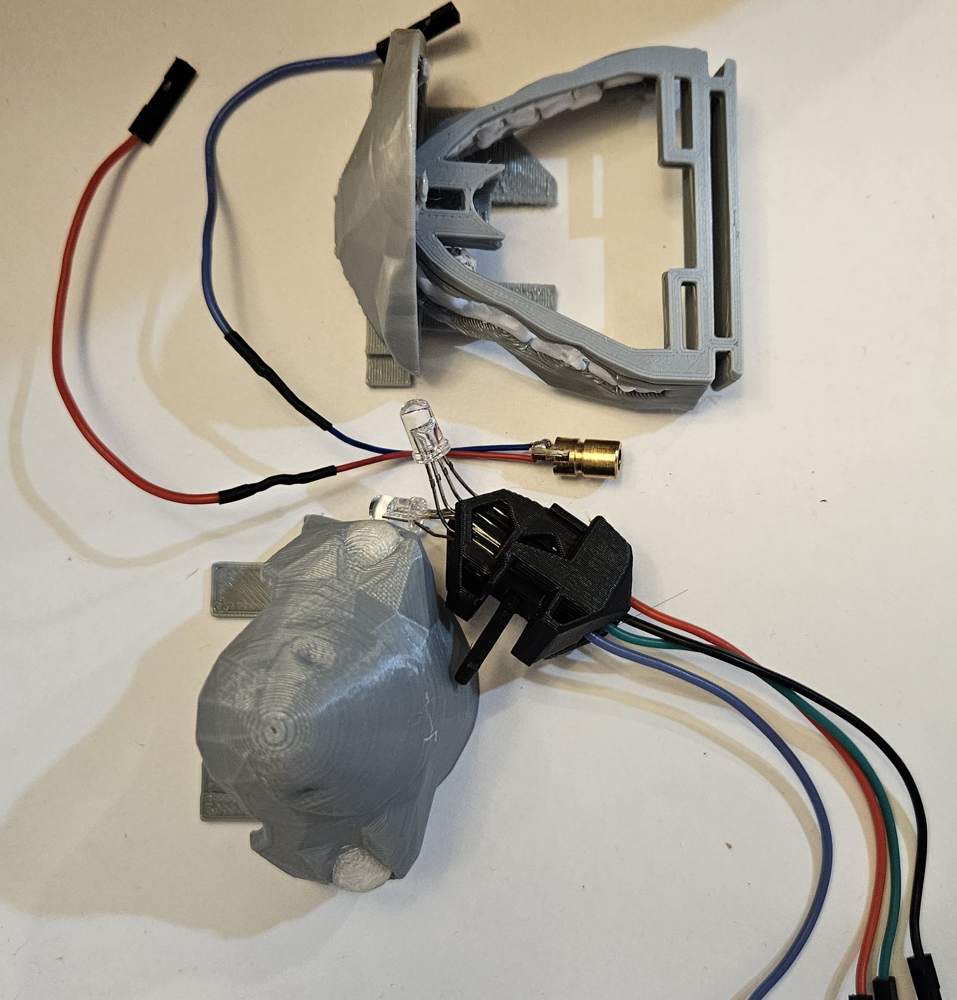
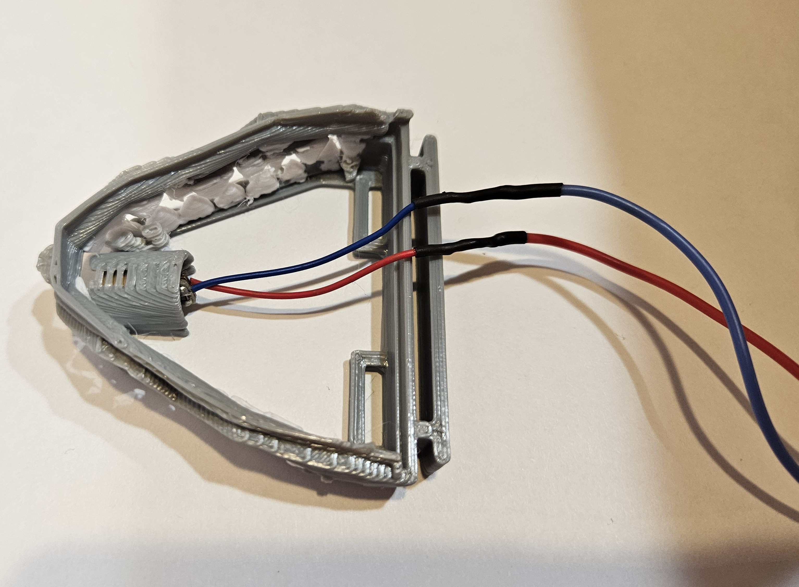
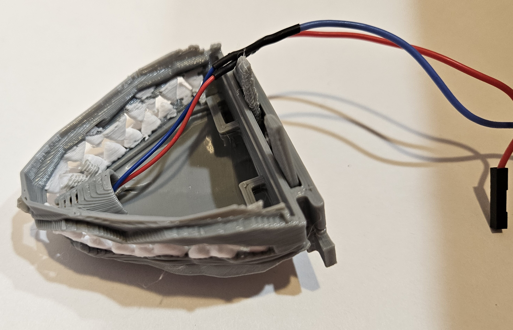
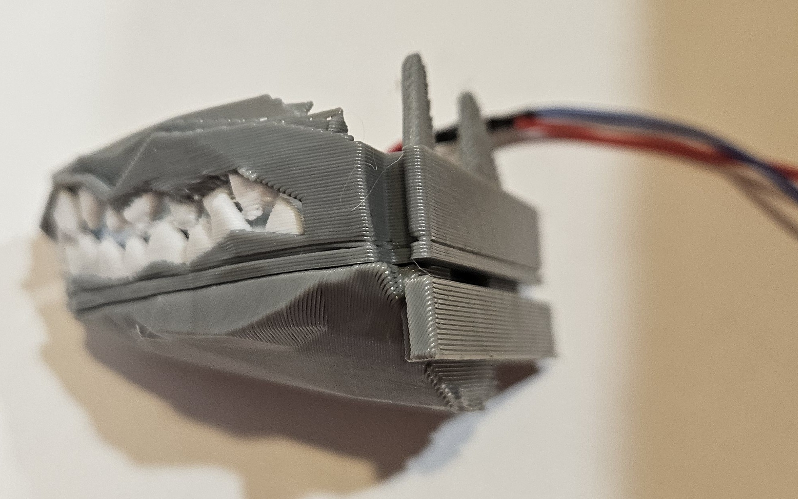
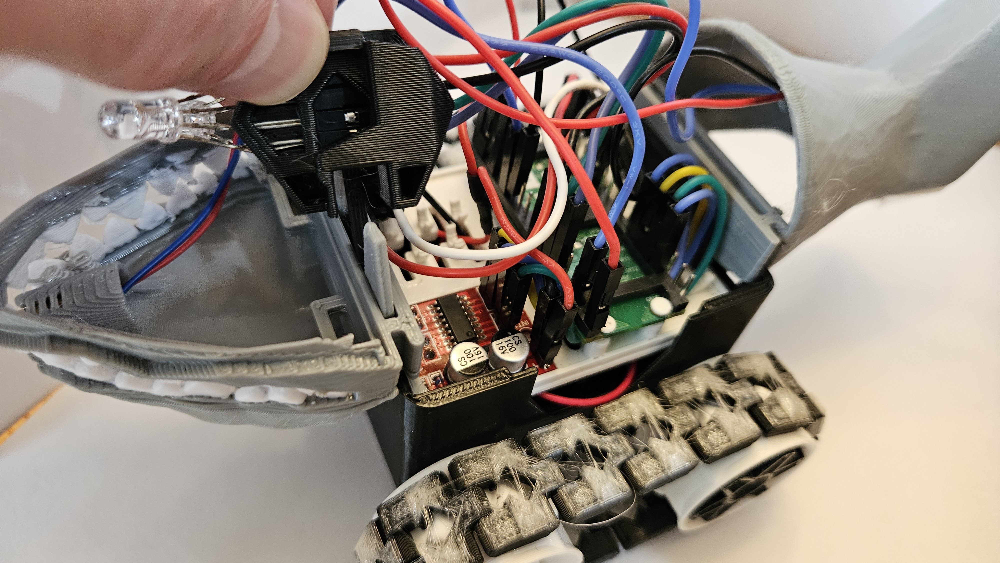
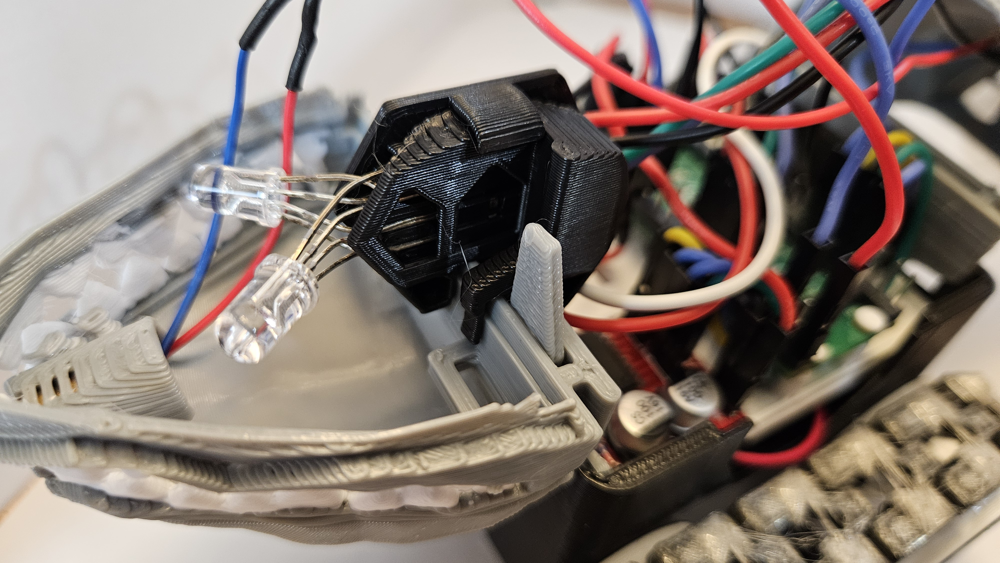
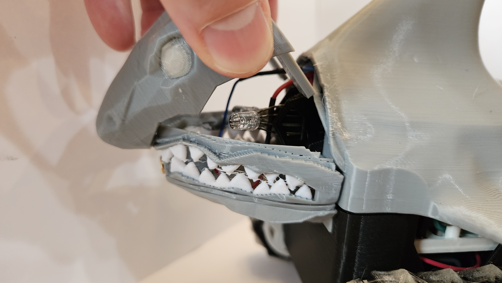
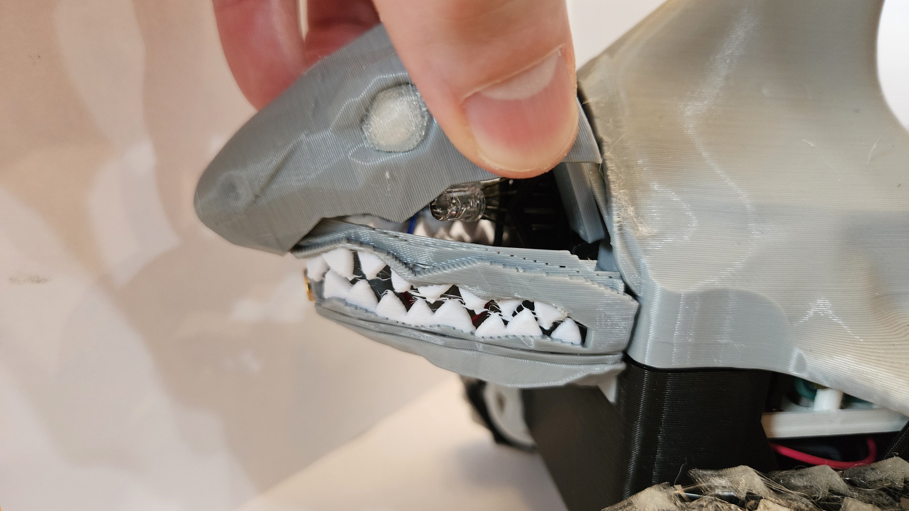
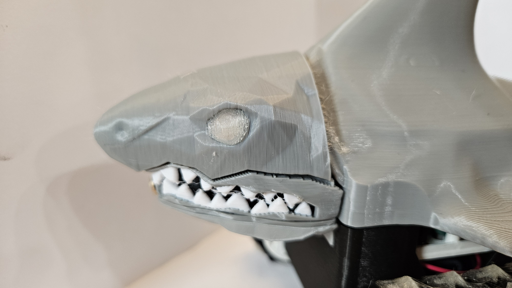

# Head Assembly Instructions

## Parts List

Before beginning the assembly, ensure you have the following four printed parts and electronics ready:

* **Head Top:** 3D printed part with the top of the head and eyes already pre-assembled.
* **Chin Piece:** Includes two upward-facing tabs/slots.
* **Teeth & Gums:** 3D printed part featuring a laser slot and alignment slots.
* **LED Harness:** Pre-loaded with LEDs and wiring — see the [LED harness assembly](rgb.md) for harness assembly instructions.
* **Laser Module**

---

## Assembly Steps

### 1. Electronics Preparation & Jaw Sub-Assembly
First, prepare the jaw unit before placing it on the rover:
* **Laser:** Insert the **Laser Module** into the center-front slot of the **Teeth & Gums** piece.
* **Chin:** Take the **Chin Piece** and slide it up from underneath the **Teeth & Gums** piece.
    * The chin slides into the single long slot at the far back of the gum piece.
    * Ensure the two tabs from the chin protrude upward through the slot.

*Visual Check: The Laser is seated flush, and the Chin is firmly slotted into the Gums.*

### 2. Mount Jaw to Rover Body
Now that the Chin and Gums are assembled (with the laser inside), place this unit onto the rover body.
* Position the sub-assembly onto the front of the chassis.
* Ensure it is seated correctly before proceeding to the wiring steps.

*Visual: The Jaw unit sitting in place on the rover chassis.*

### 3. Insert the LED Harness
With the jaw unit now mounted on the rover:
* **Wire Management:** Move the laser wires to the side to ensure they do not obstruct the harness path.
* **Alignment:** Locate the long slot in the middle of the **LED Harness**. This slot must slide *between* the two tabs from the Chin piece (which are sticking up through the gums).
* **Orientation:** Confirm the wire order matches the harness assembly (Red, Black, Green, Blue) and orient the harness so wires exit toward the rear.
* **Insertion:** Slide the LED harness down into the long slot.
* **Safety Check:** Verify that no wires are pinched during this process.

*Visual: Top-down view showing the LED harness sliding between the chin tabs while on the rover.*

### 4. Final Connection
* **Connect the Laser and LED wires according to the Wiring Table below.** See the [LED harness assembly](rgb.md) for harness assembly details.

> **Note:** The head assembly can be installed **prior** to attaching the middle cap.

**Wiring (canonical)**

- **LED Harness** (female ends to Pico):
  - RED   -> **GP22**
  - BLACK -> **GND**
  - GREEN -> **GP21**
  - BLUE  -> **GP20**

- **Laser Module** (signal/pwm):
  - SIGNAL -> **GP16** (PWM)
  - GND    -> **GND**
  - **Software note:** the laser is instantiated on pin 16 in `code/main.py` (e.g., `Laser(16)`).

> **Safety:** Do not point the laser at people, animals, or reflective surfaces. Use brief test pulses only.

**Testing the harness**
1. Run the simple LED blink example from the [LED lesson](../Led.md) to verify colors/pins.
2. Use `laser.fire(1)` from `code/laser.py` to briefly test the laser.

### 5. Attach the Head Top
To finalize the head assembly:
1.  **Route Wires:** Position your wires out of the way to ensure a clean fit.
2.  **Front Alignment:** Locate the small lip under the nose of the **Head Top** piece. Catch this lip on the overhang located directly above the laser slot (between the front two teeth of the gum piece).
3.  **Rotate & Lock:** Once the nose is caught, rotate the bottom-back of the head down into the gums.
    * The head should line up with the two small slots on the gum piece.
4.  **Snap Fit:** Press down until you hear a satisfying snap, ensuring the assembly is secure.

*Visual: The "Catch and Rotate" motion to attach the head.*

*Visual: The fully assembled head unit mounted and ready.*

### Finito!

Congratulations! You've finished the Shark Rover... now it's time to try it out in its full glory.
You probably already have the code installed and the mobile app, but if you don't install them now:

- [Install Shark Code](/lessons/assembly/code_install.md)  
- [Mobile app](https://github.com/javaplus/mad_scientist_app/blob/main/README.md)

After installing the code on the shark and getting the mobile app controls, take your shark on an adventure!
Turning the shark on, should cause the RGB LEDS to blink blue showing that it is trying to pair via bluetooth with the mobile app.  
In the mobile app, your shark name should show up in the list (You did remember to change the line of code to put your [unique shark name](https://github.com/javaplus/MadScientist/blob/main/lessons/assembly/code_install.md#main) in there didn't you?? ).
When you see your shark name in the list, click `connect` and then your shark's eyes should turn green showing its connected.  Now you are ready to drive!
