# Pico Plate & Motor Controller

### Parts

- Pico WH  
- Pico plate
- Motor Controller
- 4 x plastic pegs
- 4 x 10cm female to female wires (recommend a combination of blue, yellow, and green)
- 1 x 10cm black or white female to female wire 

***Pico WH, Pico Plate, and pegs(Note colors may be different than pictured)**
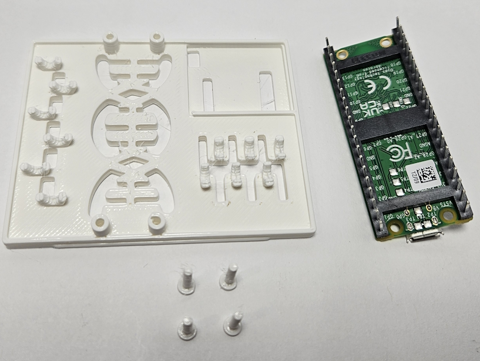

***5 10cm female to female wires**  
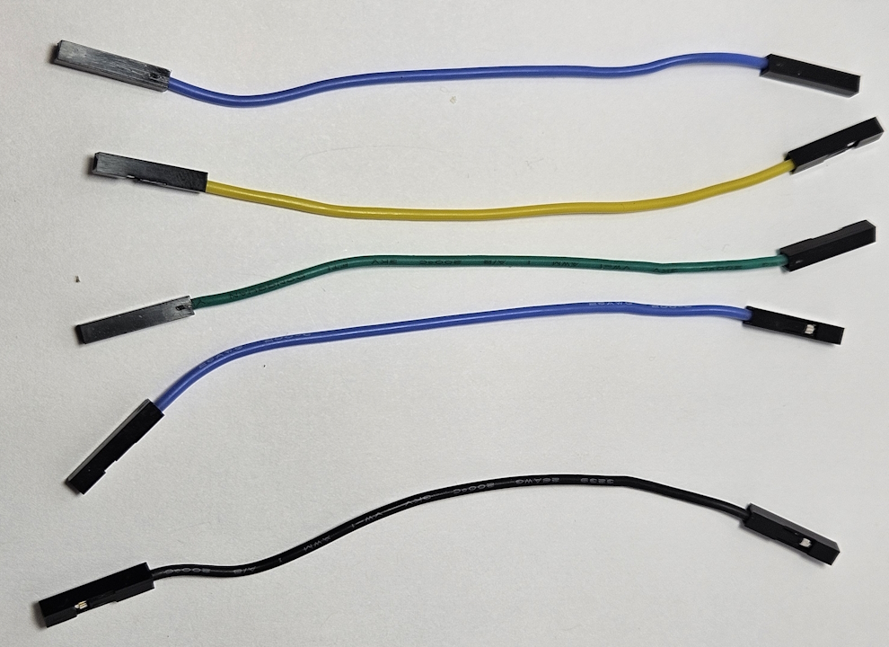

### Pico Installation

Take your Pico plate (the flattish square piece) and your Pico W. On the Pico plate, there is a small square in the corner (this will hold the motor controller).  Orient the plate so that the square is in the bottom left.

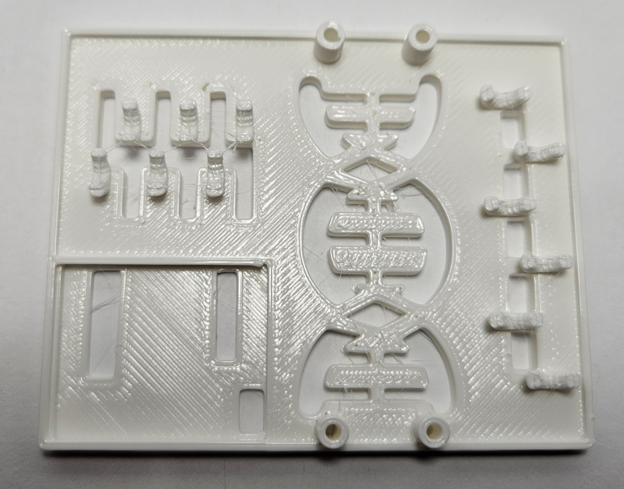

Turn the Pico so the pins are sticking up in the air and the USB jack is pointing away from you.  Now, place the Pico W on the raised pedestals on the plate.  These should align with the four holes in the Pico.

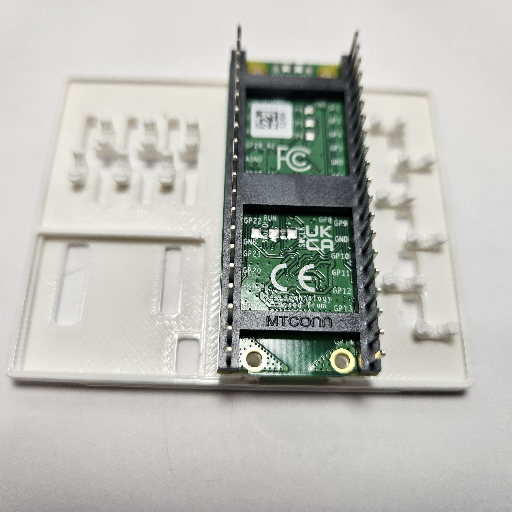

Take your 4 plastic pegs and align them with the 4 holes on the Pico W. Do **NOT** push them all the way in yet.  Push the pins **halfway** down into the plate to secure it, but still leaving enough room raise the Pico a bit to route wires underneath it later.

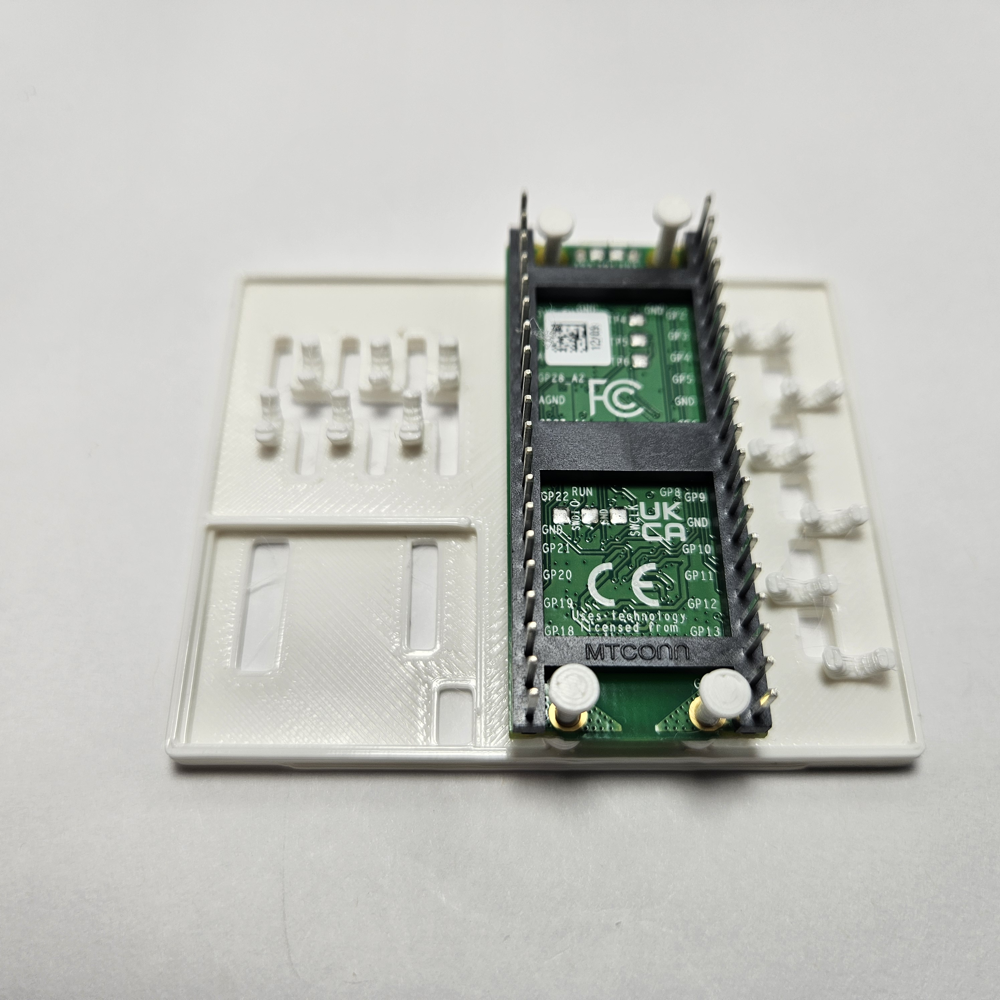

### Motor Controller

#### Mount the Motor Controller
Take the motor controller and put it into the bottom left square on the Pico plate so that the 4 lone pins that stick downward go through the bottom slot on the far bottom left of the recessed square.  The best way to do this is to align the downward 4 pins through the hole, and then angle the motor controller so the part at the bottom snaps in last.  The motor controller should snap securely into the recessed square. the top of the red part of the motor controller should be slightly lower than the top surface of the Pico plate.

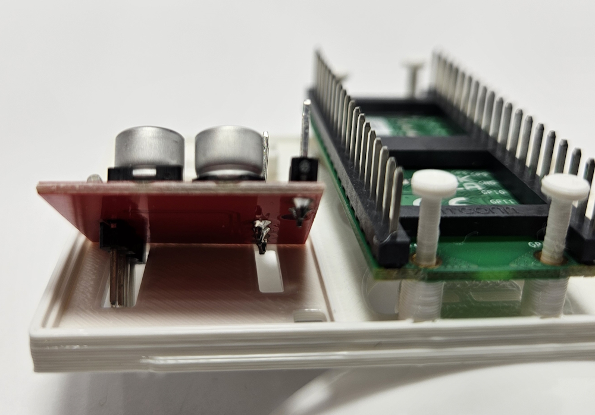

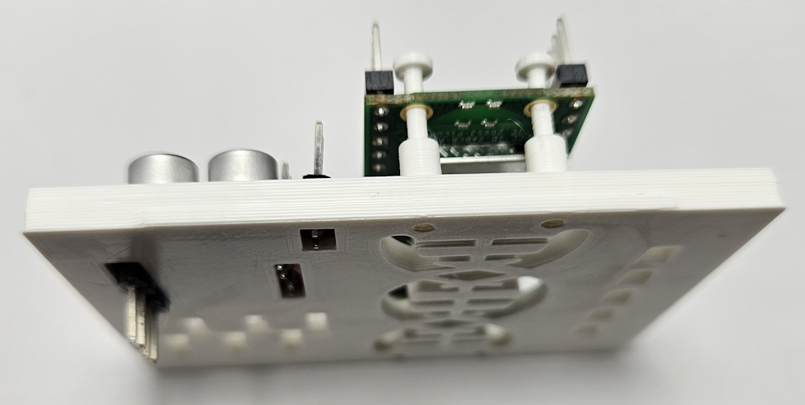

#### Wire the Motor Controller

Take your 5 10cm female to female wires and fish them under the Pico so that the female ends are on opposite sides of the Pico.

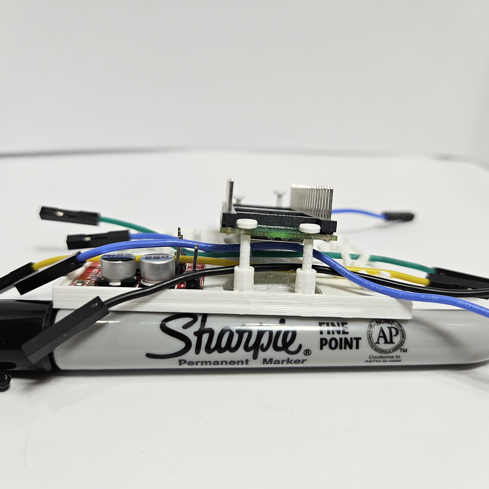

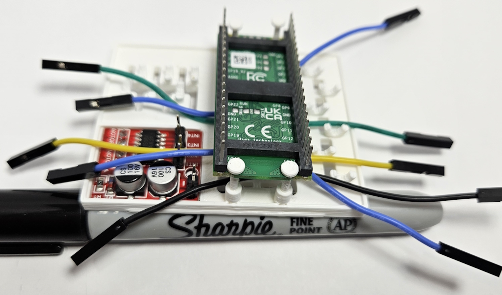

Connect the following pins using your blue, green, and yellow 4 x 10cm female to female wires 

| Motor controller pin | Pico pin |
|----------------------|----------|
| INT1                 | GP13     |
| INT2                 | GP12     |
| INT3                 | GP10     |
| INT4                 | GP11     |

**NOTE:** These pictures show the black wire connected at this point,  you'll do that in the next step.  
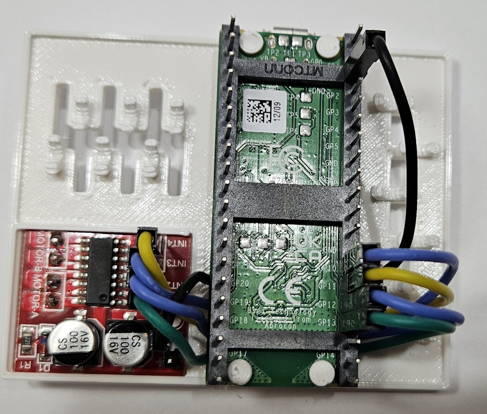

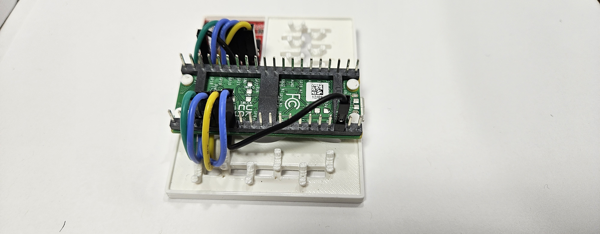

Take the black or white 10cm female to female wire and connect it to the (-) negative terminal on the motor controller to a ground on the Pico.  We find the ground pin that is 3 down from the top right is best for this due to wire management.

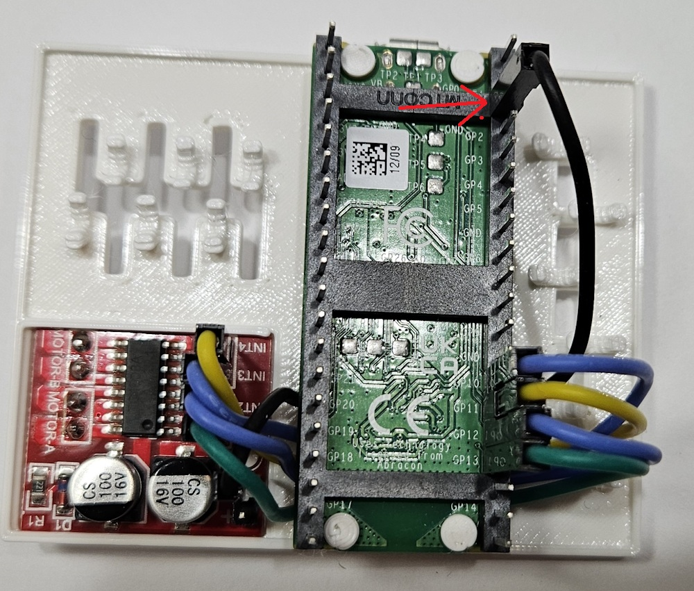  
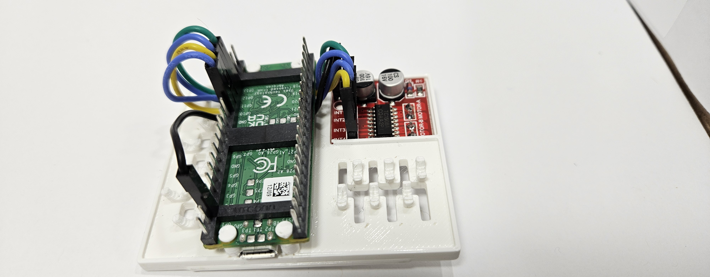
At this point, the motor controller is just missing a cable to its (+) positive terminal and the 4 Motor pins on the bottom are unconnected.  We will connect those when we put the plate on the chassis.
Now, fully press down the 4 pegs that hold the Pico in place to secure it.  Don't use a ton of force and don't worry if they don't go all the way in.  They just need to keep the Pico from moving around or coming off the plate.

[next](https://github.com/javaplus/MadScientist/blob/main/lessons/assembly/chassis.md)
