# Pico Plate & Motor Controller

## Parts

- Pico WH  
- 4 x 10cm female to female wires (recommend a combination of blue, yellow, white, and green)

***Pico WH and wires(Note colors may be different than pictured)**
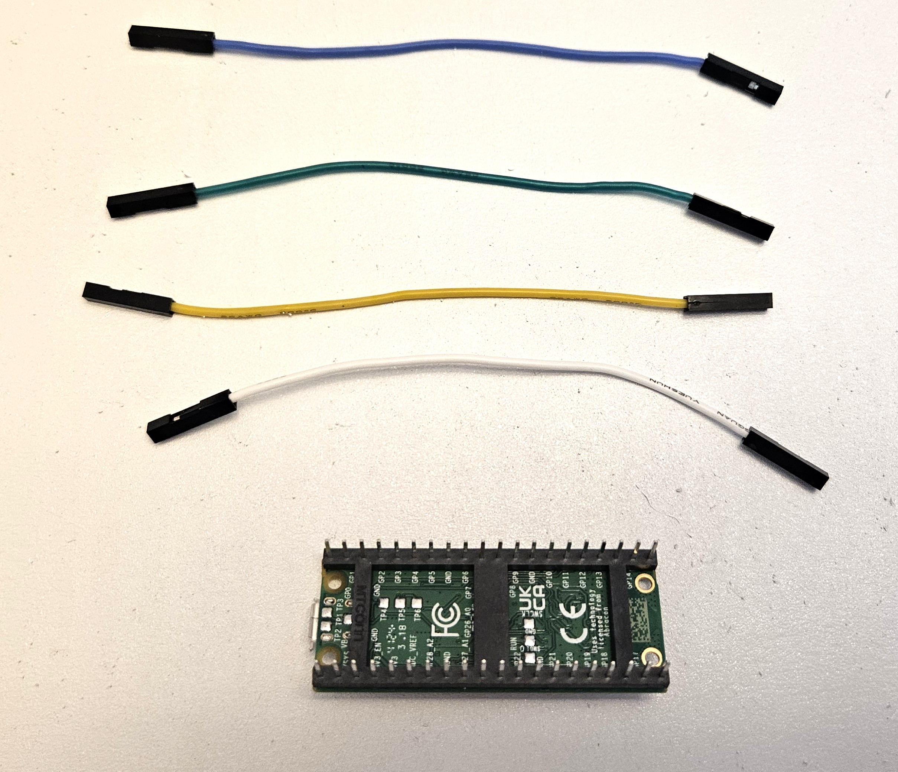

## Prepare Pico Wires for Motor Controller

We are now going to connect our 4 wires to the Pico that will eventually connect to the motor controller that will allow the Pico to control our motors.

Your 4 wires will go on the GPIO pins GP10, GP11, GP12, and GP13.

	
More Details

	The exact color of the wires doesn't matter, but it may be easier to follow the pictures. The wires go together in pairs to control the 2 motors. The GP10 and 11 pins control one motor by going to the Motor Controller's INT3 and INT4. While the GP12 and 13 pins on the Pico need to connect to the INT1 and INT2 pins. 

Take your 4 wires and connect them to the Pico as indicated in the picture below.

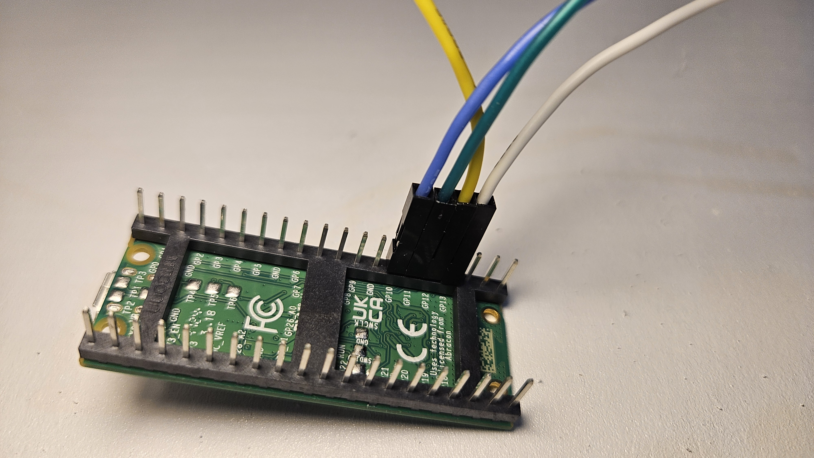

Now your Pico wires are ready to connect to the motor controller, but let's mount the motor controller to the plate first.

## Motor Controller Install

### Parts
Grab the Pico plate (the flattish square piece) and your motor controller.

Orient the plate so that the square is in the bottom left as seen below.

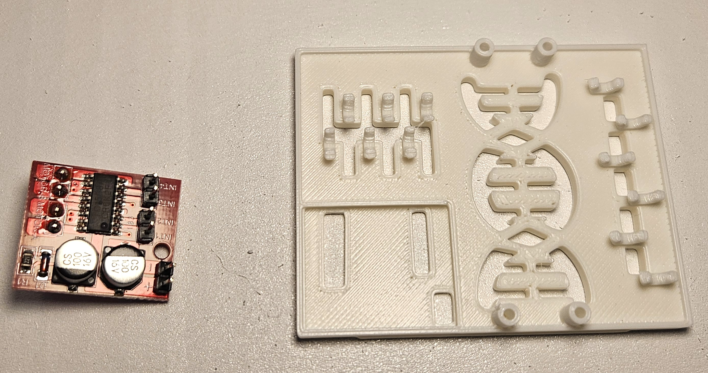

### Mount the Motor Controller

Take the motor controller and put it into the bottom left square on the Pico plate so that the 4 pins on the left side of the motor controller go through the slot on the left of the recessed square.  The 6 pins of the motor controller should be facing up and on the right side of the recessed square. To snap the motor controller in the recessed slot, align the downward 4 pins through the hole, and then angle the motor controller so that the side opposite the capacitors (the round silver things) goes in the recess first. Then the side with the capacitors; which are closest to the bottom edge and closest to you in the picture, will go in last.

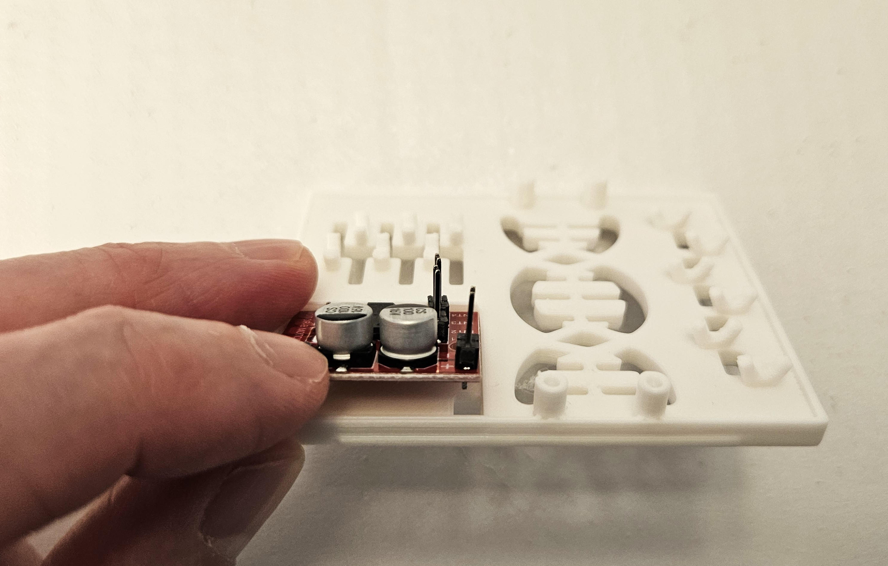

Using your thumbs on top of the capacitors, snap the motor controller securely into the recessed square. It will take a little force, but you should be able to feel a satisfying snap when it goes in place.

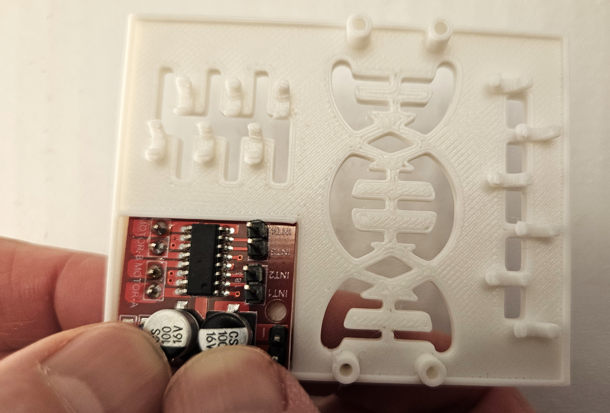

The top of the red part of the motor controller should be slightly lower than the top surface of the Pico plate when fully snapped in place as seen in the picture below.

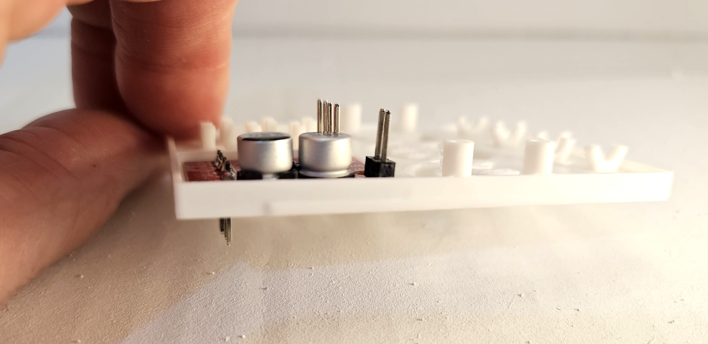

## Wire Pico and Motor Controller

Now take the Pico with the 4 connected wires and place beside the Pico plate to left of the motor controller.  At this time, do not place the Pico on the Pico plate, but just beside it so the wired side of the Pico is next to the motor controller so you can easily connect the wires to the motor controller.  Now connect the wires from the Pico to the motor controller as seen in the picture below with the GP10 and GP11 pins(Blue and Green wires in the picture) on the Pico connected to the INT 4 and INT 3 connections on the motor controller. Then connect the GP12 and GP13 pins(Yellow and White) of the Pico to the INT 2 and INT 1 of the motor controller. See the pictures below for the correct wiring.

|  Pico pin | Motor controller pin| Color  |
|-----------|---------------------|--------|
| GP10      | INT 4               | Blue   |
| GP11      | INT 3               | Green  |
| GP12      | INT 2               | Yellow |
| GP13      | INT 1               | White  |

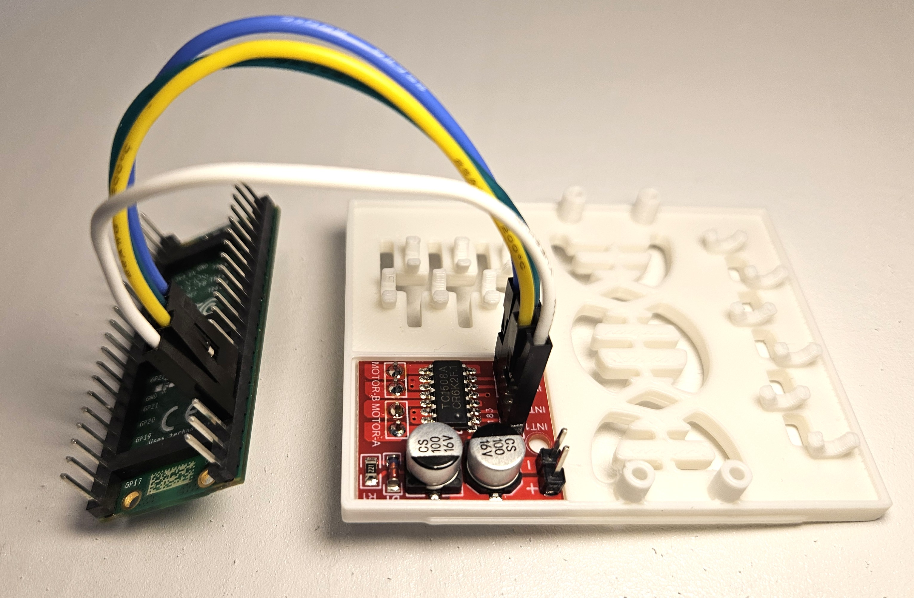

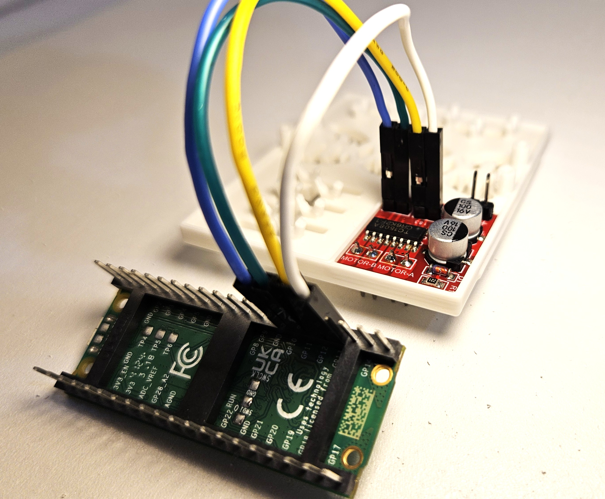

### Mount the Pico on the Pico Plate

Now find your 4 pico pins to mount your Pico to the plate. (**NOTE**: Your pins may be a different color than those in the picture below.)

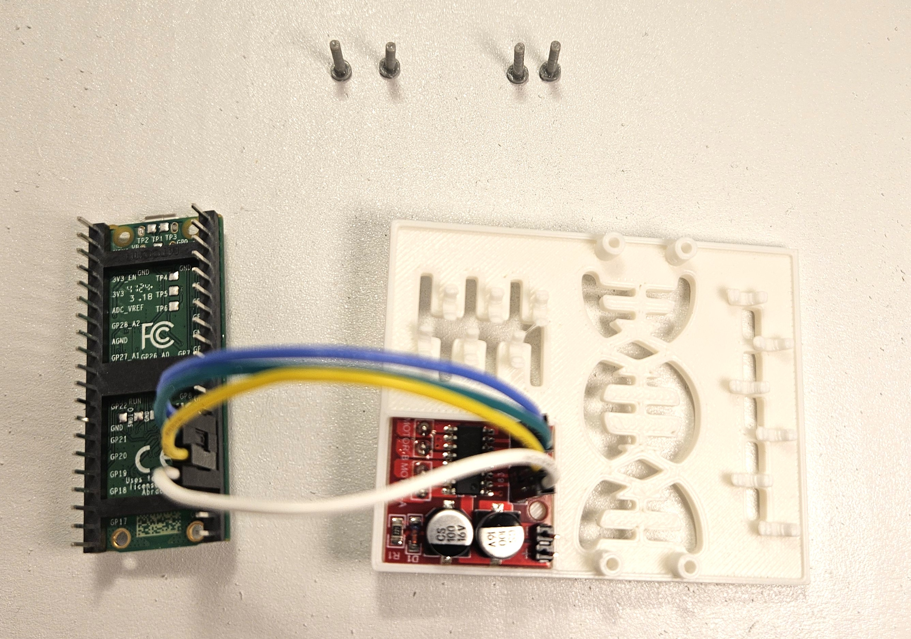

Now pick up the Pico and move it over the motor controller so the wires tuck below the Pico as seen below:

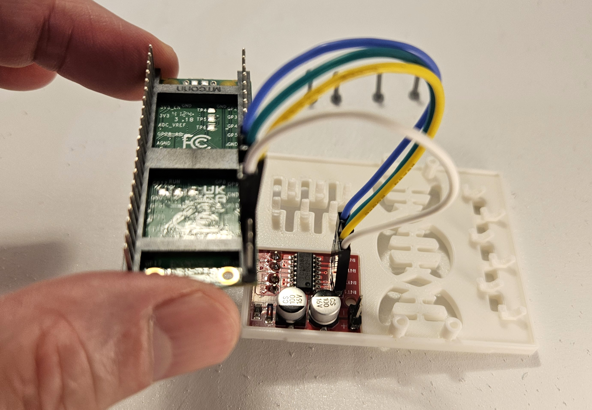
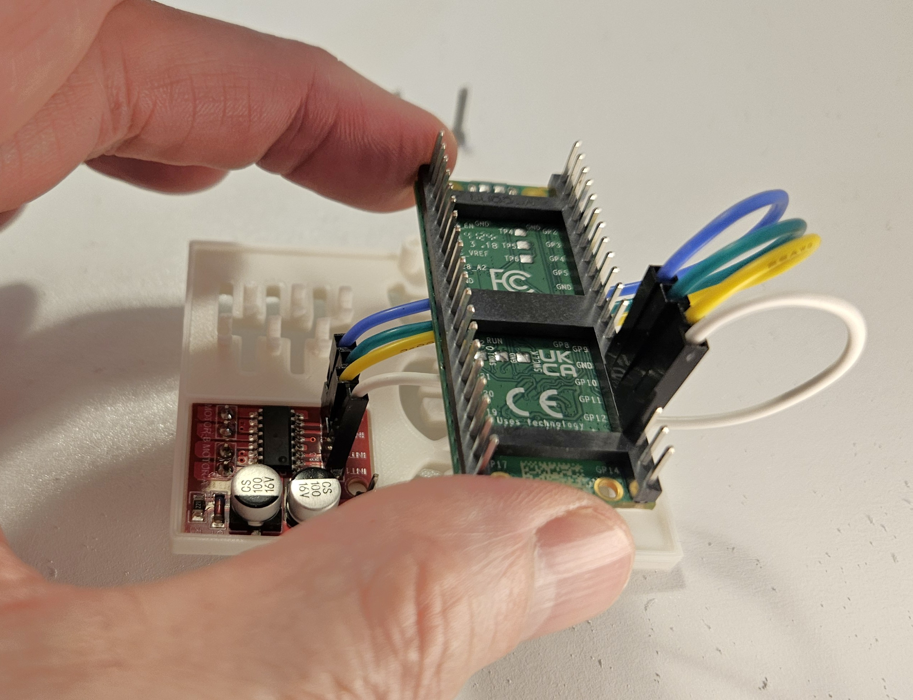

Now position the Pico, with the wires underneath, so that the 4 holes on the Pico line up with the 4 raised posts on the Pico Plate.  Now insert your pins through the holes to secure the Pico in place.  Try to push the pins all the way down, but don't use too much force and it's ok if the Pico has a little play with it.  As long as the Pico doesn't easily come off the Pico plate, you should be good. In a pinch, using 2 in opposite corners will work. 

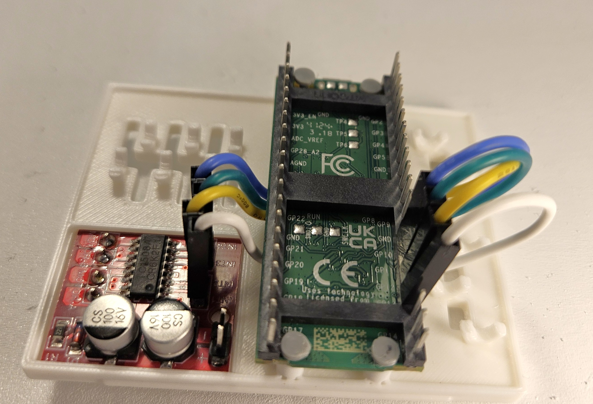

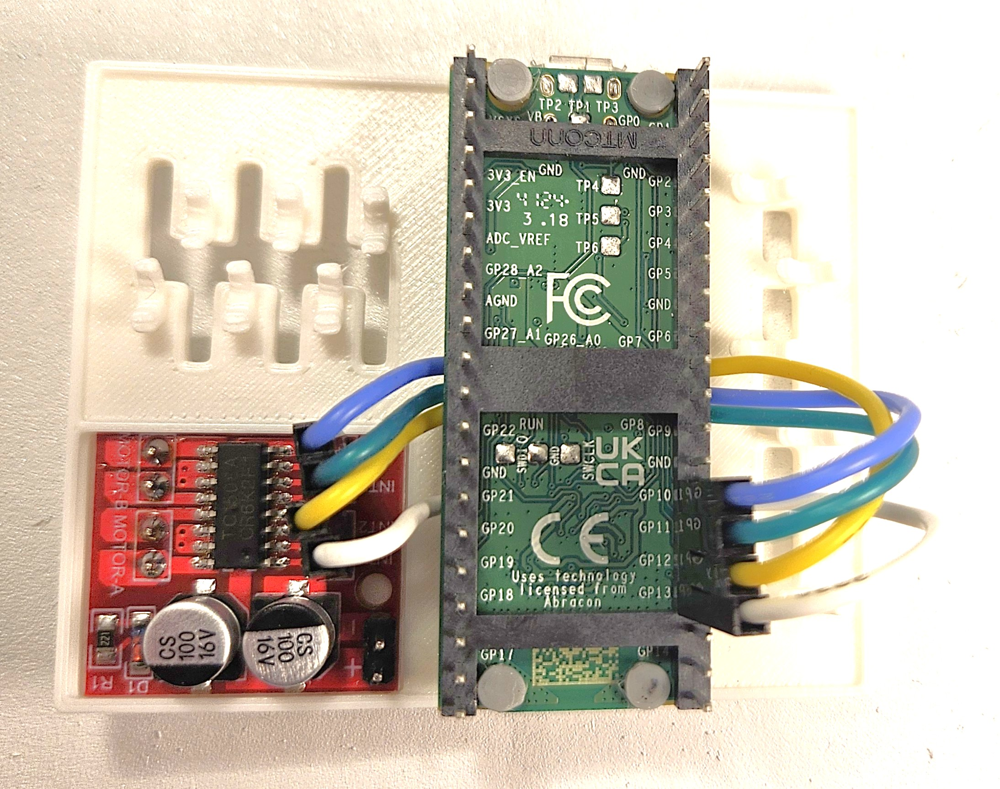

[next](https://github.com/javaplus/MadScientist/blob/main/lessons/assembly/chassis.md)
