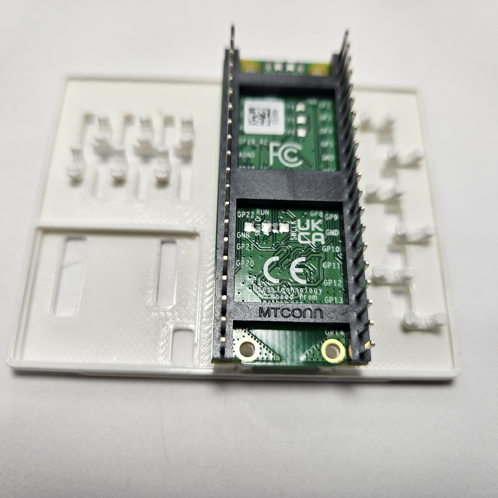
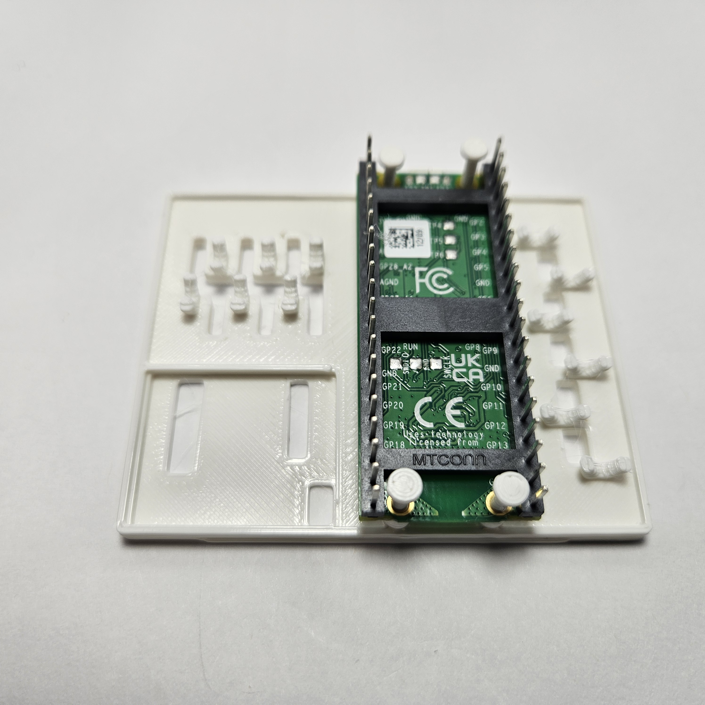
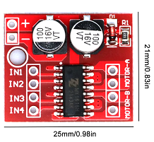
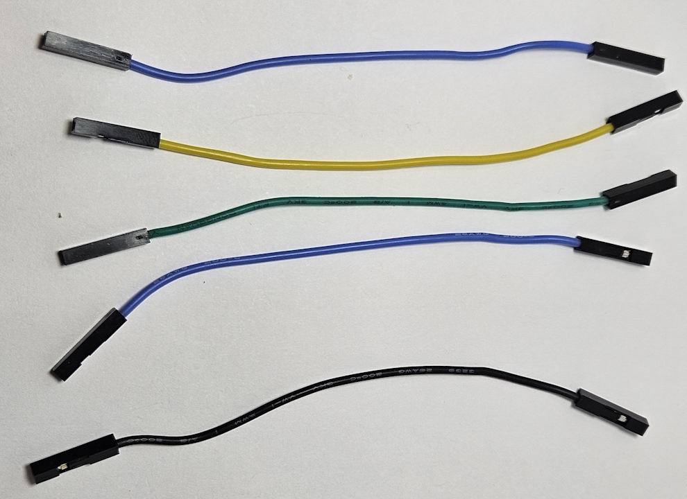
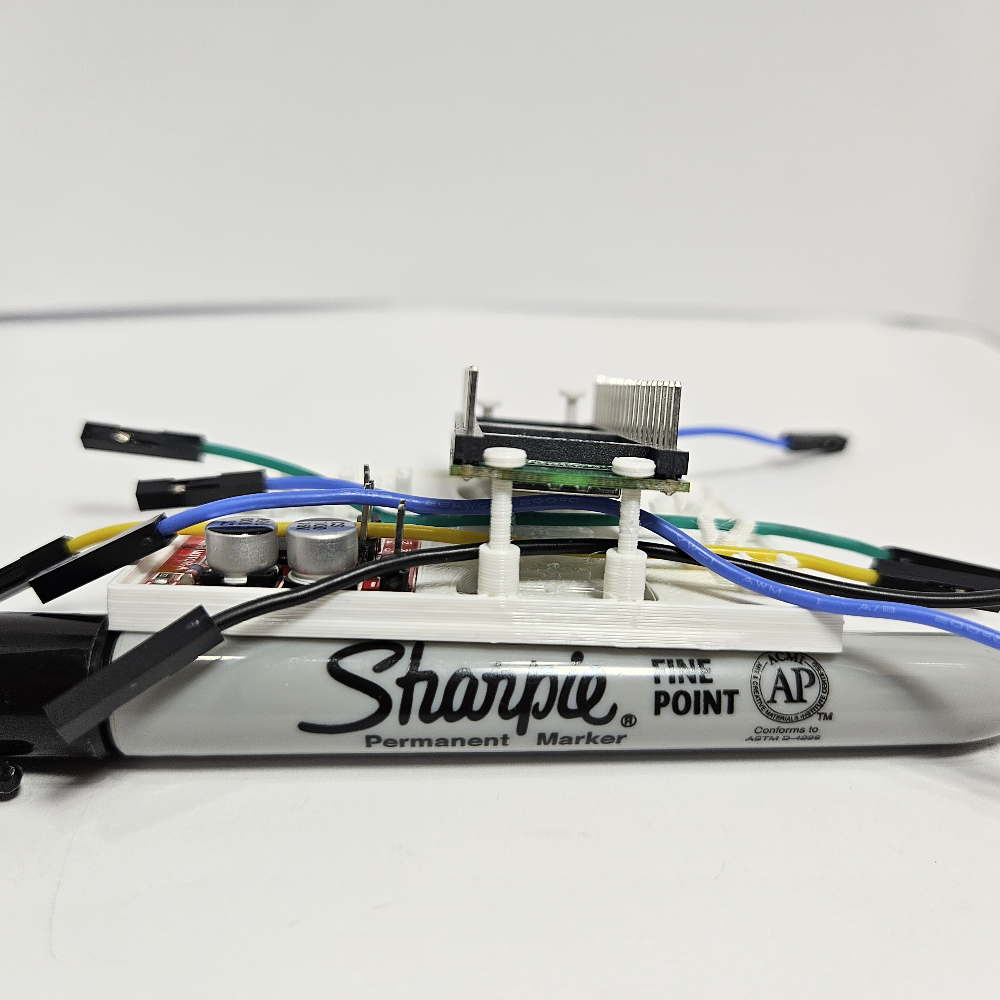
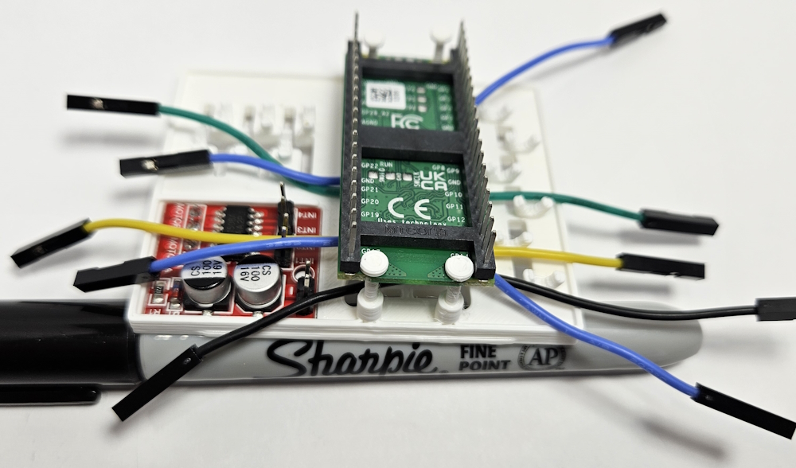
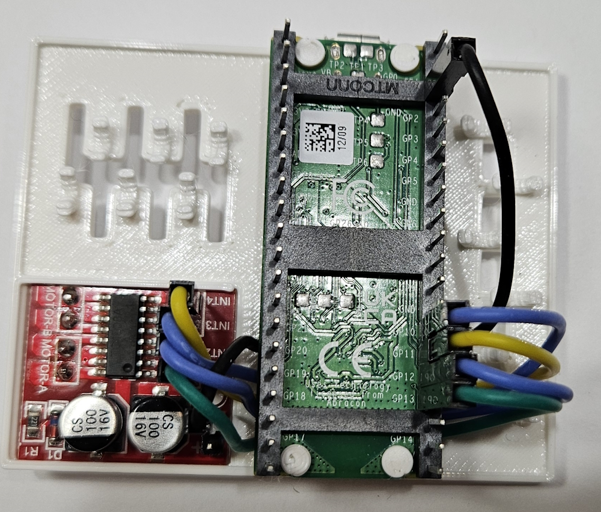
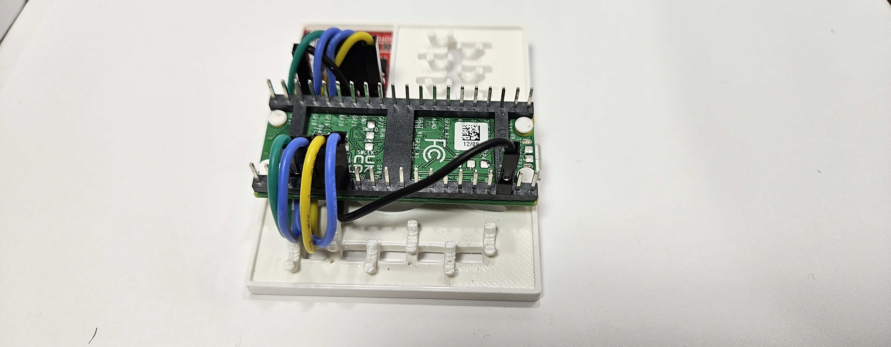
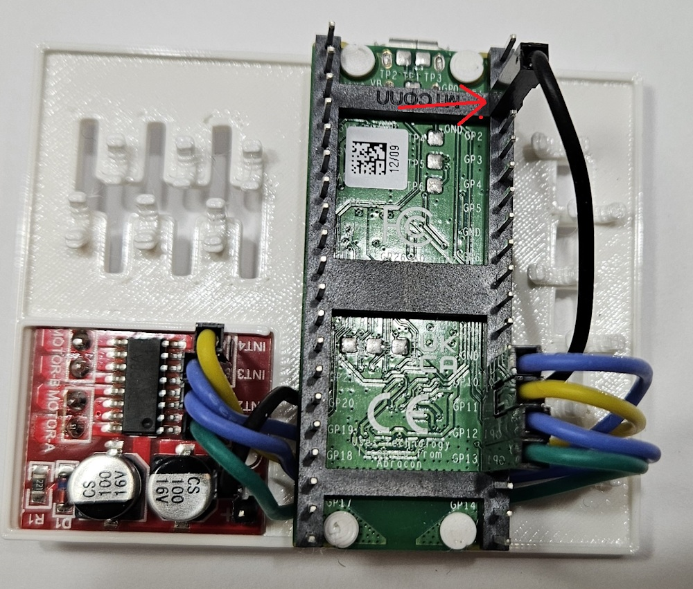
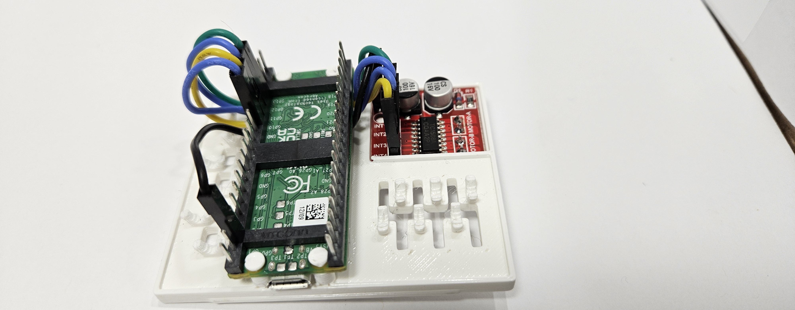

# Pico Plate & Motor Controller

## Parts

- Pico WH  
- 4 x 10cm female to female wires (recommend a combination of blue, yellow, white, and green)

***Pico WH and wires(Note colors may be different than pictured)**

## Prepare Pico Wires for Motor Controller

We are now going to connect our 4 wires to the Pico that will eventually connect to the motor controller that will allow the Pico to control our motors.

Your 4 wires will go on the GPIO pins GP10, GP11, GP12, and GP13.

	
More Details

	The exact color of the wires doesn't matter, but it may be easier to follow the pictures. The wires go together in pairs to control the 2 motors. The GP10 and 11 pins control one motor by going to the Motor Controller's INT3 and INT4. While the GP12 and 13 pins on the Pico need to connect to the INT1 and INT2 pins. 

Take your 4 wires and connect them to the Pico as indicated in the picture below.

Now your Pico wires are ready to connect to the motor controller, but let's mount the motor controller to the plate first.

## Motor Controller Install

### Parts
Grab the Pico plate (the flattish square piece) and your motor controller.

Orient the plate so that the square is in the bottom left as seen below.

### Mount the Motor Controller

Take the motor controller and put it into the bottom left square on the Pico plate so that the 4 pins on the left side of the motor controller go through the slot on the left of the recessed square.  The 6 pins of the motor controller should be facing up and on the right side of the recessed square. To snap the motor controller in the recessed slot, align the downward 4 pins through the hole, and then angle the motor controller so that the side opposite the capacitors (the round silver things) goes in the recess first. Then the side with the capacitors; which are closest to the bottom edge and closest to you in the picture, will go in last.

Using your thumbs on top of the capacitors, snap the motor controller securely into the recessed square. It will take a little force, but you should be able to feel a satisfying snap when it goes in place.

The top of the red part of the motor controller should be slightly lower than the top surface of the Pico plate when fully snapped in place as seen in the picture below.

## Pico Install

Now take the Pico with the 4 connected wires and place beside the Pico plate to left of the motor controller.  At this time, do not place the Pico on the Pico plate, but just beside it so the wired side of the Pico is next to the motor controller so you can easily connect the wires to the motor controller.  Now connect the wires from the Pico to the motor controller as seen in the picture below with the GP10 and GP11 pins on the Pico connected to the INT 4 and INT 3 connections on the motor controller. Then connect the GP12 and GP13 pins of the Pico to the INT 2 and INT 1 of the motor controller.    

Turn the Pico so the pins are sticking up in the air and the USB jack is pointing away from you.  Now, place the Pico W on the raised pedestals on the plate.  These should align with the four holes in the Pico.

Take your 4 plastic pegs and align them with the 4 holes on the Pico W. Do **NOT** push them all the way in yet.  Push the pins **halfway** down into the plate to secure it, but still leaving enough room raise the Pico a bit to route wires underneath it later.

## Motor Controller

***Motor Controller**  

- Pico plate
- Motor Controller
- 4 x plastic pegs

#### Wire the Motor Controller

Take your 5 10cm female to female wires and fish them under the Pico so that the female ends are on opposite sides of the Pico.

Connect the following pins using your blue, green, and yellow 4 x 10cm female to female wires.
These wires are actually in pairs. So, keep the yellow and blue wire pair next to each other on the motor controller and then Pico and then keep the blue and green pair of wires next to each other on the Pico and motor controller

| Motor controller pin | Pico pin |  Color |
|----------------------|----------|--------|
| INT1                 | GP13     | Green  |
| INT2                 | GP12     | Blue   |
| INT3                 | GP10     | Blue   |
| INT4                 | GP11     | Yellow |

**NOTE:** These pictures show the black wire connected at this point,  you'll do that in the next step.  

Take the black or white 10cm female to female wire and connect it to the (-) negative terminal on the motor controller to a ground on the Pico.  We find the ground pin that is 3 down from the top right is best for this due to wire management.

  

At this point, the motor controller is just missing a cable to its (+) positive terminal and the 4 Motor pins on the bottom are unconnected.  We will connect those when we put the plate on the chassis.
Now, fully press down the 4 pegs that hold the Pico in place to secure it.  Don't use a ton of force and don't worry if they don't go all the way in.  They just need to keep the Pico from moving around or coming off the plate.

[next](https://github.com/javaplus/MadScientist/blob/main/lessons/assembly/chassis.md)
