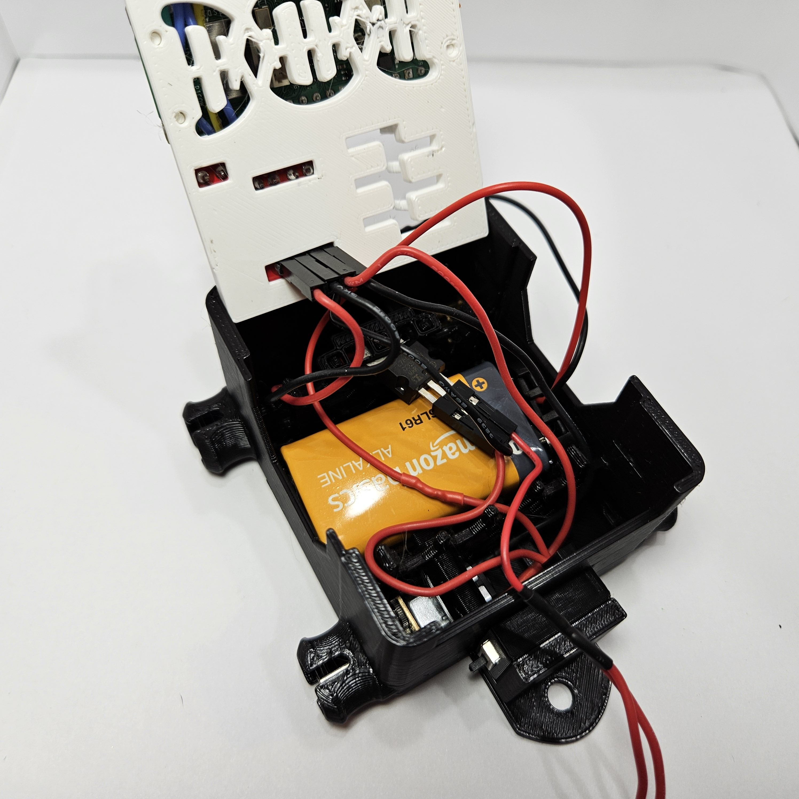
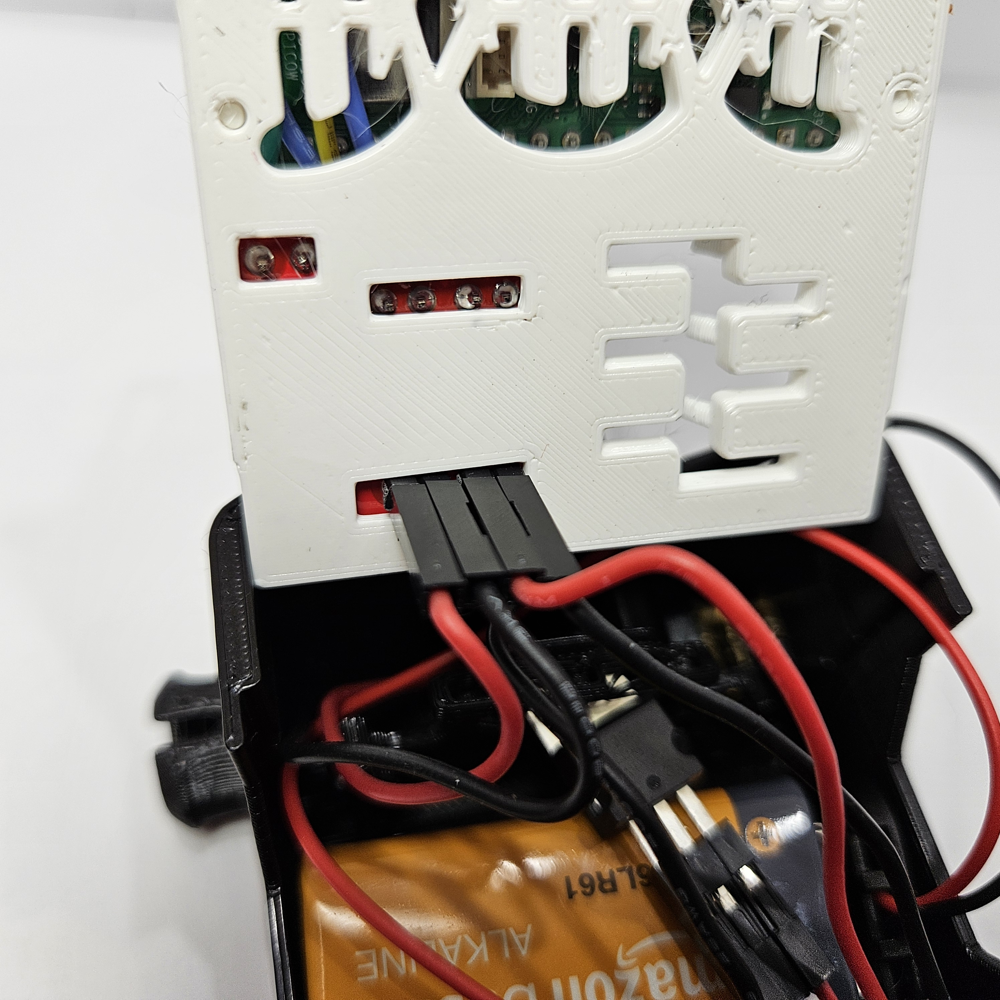
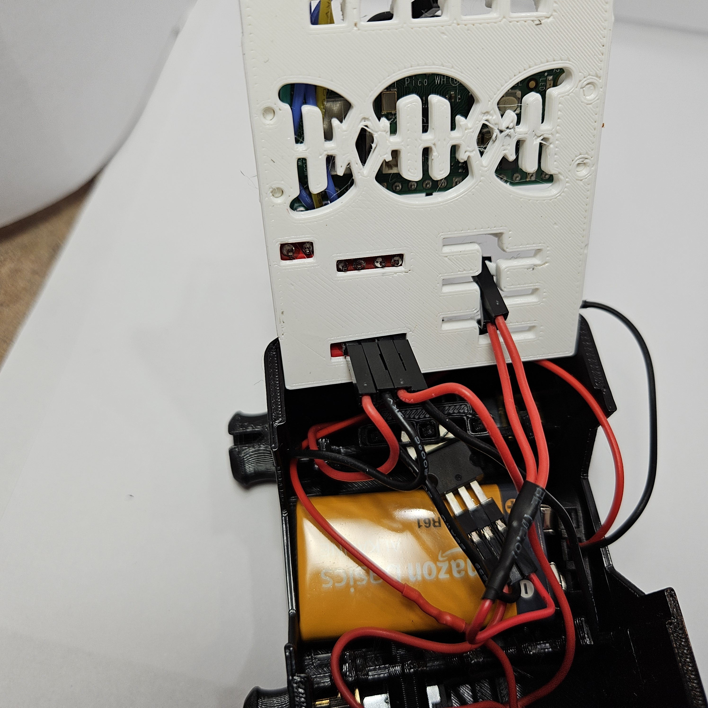
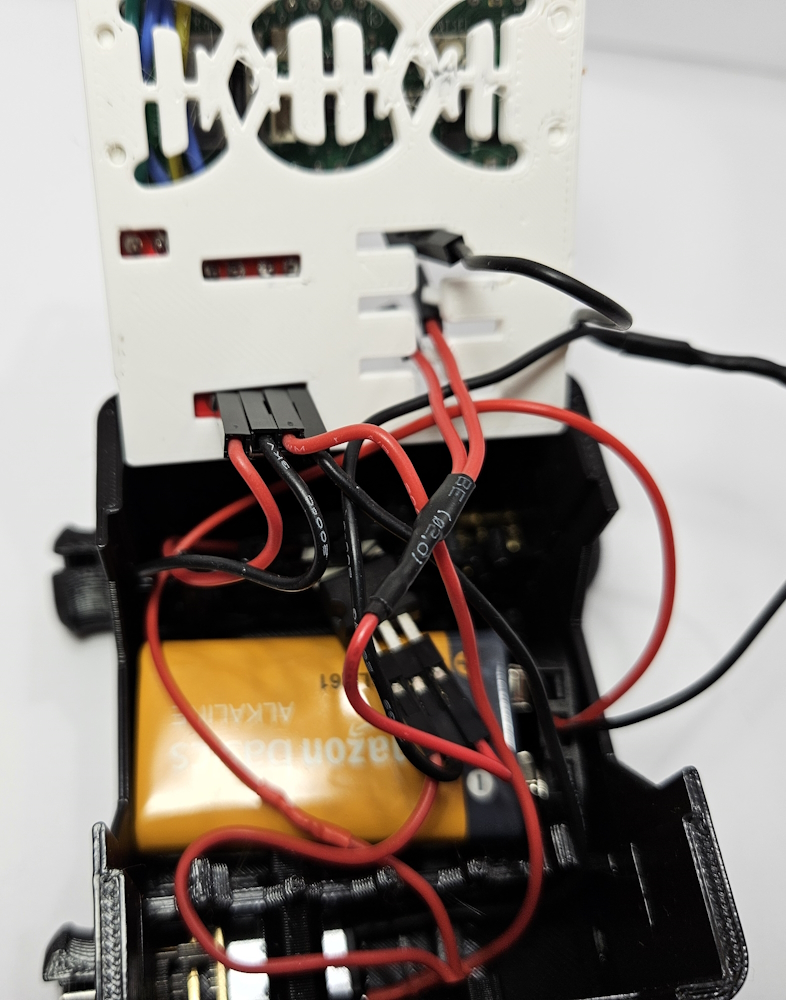
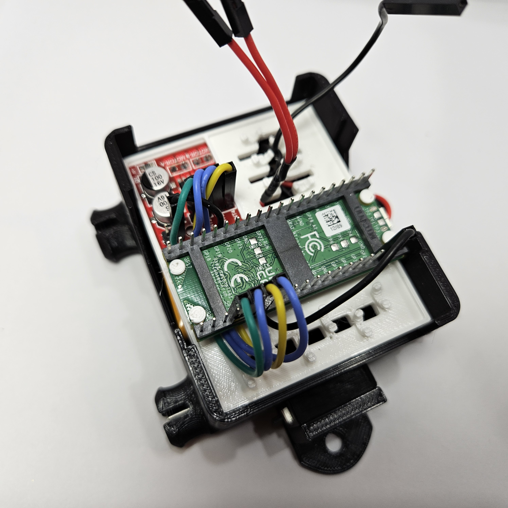
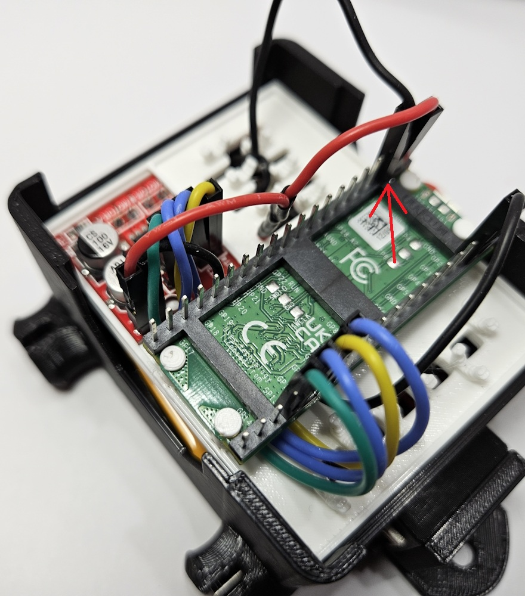
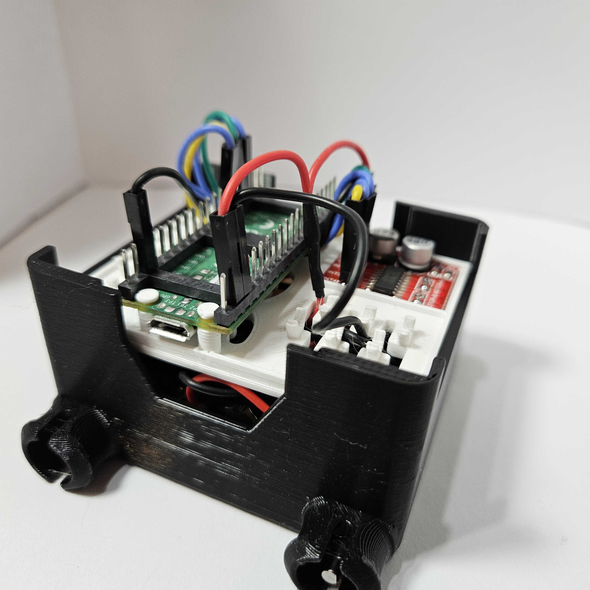
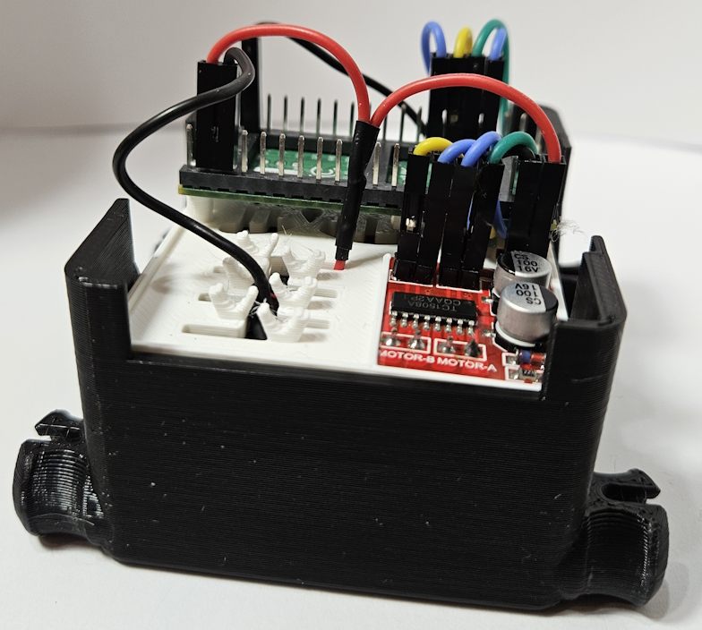

# Add Plate on Chassis

### Parts
- Pico plate (with Pico and motor controller)
- Chassis

In this step, we will take the Pico plate with the Pico and motor controller and attach it to the chassis.  

Before we can put the plate down on the chassis, we need to connect the motors to the motor controllers pins that stick out below the plate.  Position the chassis so that the hitch is facing towards you and the motor controller is at the opposite side of the chassis.
See below picture for proper orientation.   
Connect the front motor to the `motor A` pins on the motor controller. The ``motor A`` pins are the first two pins on the left in the picture below.  Connect the rear motor to the `motor B` pins.  Run the wires for the rear motor over the battery. You don't have to worry about the color of the wire and which pin it goes to.  As long as the front motor wires are connected to the `motor A` pins and the rear motor is connected to `motor B` pins, then which wire (red vs black) connects to which pin doesn't matter.   The reason the color doesn't matter is because the motor controller can send power in both directions to a motor and therefore we can control in the code which way to send the power to get the motors to spin in the direction we want.

Close up:

Run the two ends of the red Y power cable from the voltage regulator up through the Pico plate and through the vertical slot to the right of the motor controller:

Run the ground (black) wire from the battery connector up through the same vertical slot in the plate:

Carefully push the plate down onto the chassis.  Make sure that the wires aren't disconnected or pinched between the plate and chassis.  The plate should sit flush with the cutout in the front and rear of the chassis.

Now it's time to connect the power cables from the voltage regulator and battery to the Pico and motor controller.

Take the two red wires and connect one to the Pico's VSYS pin (left side, second down from the top in the below picture).  The other red wire goes to the (+) pin on the motor controller.  

Here's a pinout diagram if you want to use it instead of the pictures:  

 Click here to hide/show Pico Pin Out.
 
 

The ground/black wire goes to a ground pin on the Pico.  We recommend the ground pin right next to the VSYS.  That is 3 pins down from the top left in the picture.

Congratulations! You are super close to having a mobile rover!

Actually, if you already have your wheels and tracks installed, you may want to go ahead and install the code and test out what you have built.

You should be able to install the code and use the mobile app to test the basic drivability of your rover.

- [Install Shark Code](/lessons/assembly/code_install.md)  
- [Mobile app](https://github.com/javaplus/mad_scientist_app/blob/main/README.md)

[back](https://github.com/javaplus/MadScientist/blob/main/lessons/assembly/power.md)                

[next](https://github.com/javaplus/MadScientist/blob/main/lessons/assembly/tail.md)
