# Add Plate on Chassis

### Parts
- Pico plate (with Pico and motor controller)
- Chassis

In this step, we will take the Pico plate with the Pico and motor controller and attach it to the chassis.  

### Connecting the Motors

Before we can put the plate down on the chassis, we need to connect the motors to the motor controllers pins that stick out below the plate.  Position the chassis so that the hitch is facing towards you which means the power switch also is closest to you.  Then position the pico plate with the motor controller at the opposite side of the chassis.
See below picture for proper orientation.   

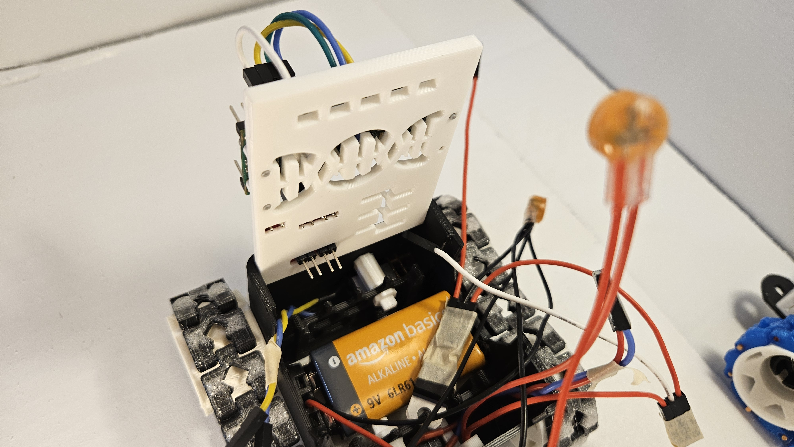

Now you will connect the motor wires to the motor controller pins that stick down through the pico plate. Connect the front motor to the `motor A` pins on the motor controller. The ``motor A`` pins are the first two pins on the left in the picture above. 

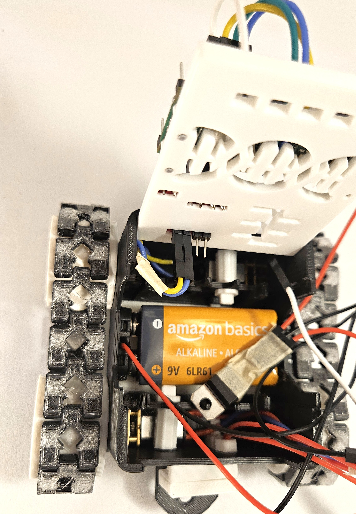

 Connect the rear motor to the `motor B` pins.  Run the wires for the rear motor over the battery. You don't have to worry about the color of the wire and which pin it goes to.  As long as the front motor wires are connected to the `motor A` pins and the rear motor is connected to `motor B` pins, then which wire connects to which pin doesn't matter.   The reason it doesn't matter is because the motor controller can send power in both directions to a motor and therefore we can control in the code which way to send the power to get the motors to spin in the direction we want.

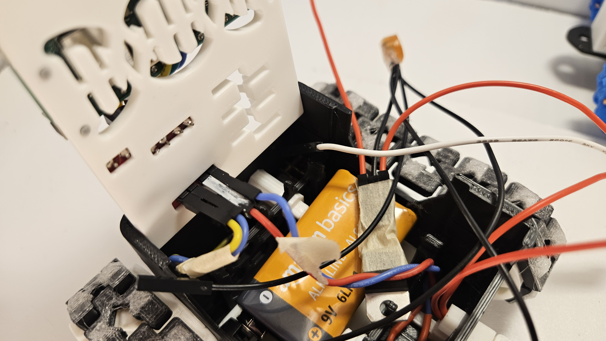

### Running the Power Wires

Now we need to route all the unconnected wires from the power up through the Pico Plate.  So, you should have 2 black ground wires and 2 positive wires(one red and one white).  Be sure to know which wire is coming straight from the 3 way connector and which is coming from the Voltage Regulator.  The one coming from the 3 way connector is carrying 9volts and could damage the Pico if we accidentally plugged it in there.  In our picture the white wire is carrying the 9volts and will go to the motor controller eventually.  For now, just run all 4 wires through the slots in the bottom right of the Pico Plate. Their position in the slots doesn't matter, just have them all poke through to the other side of the Pico plate.

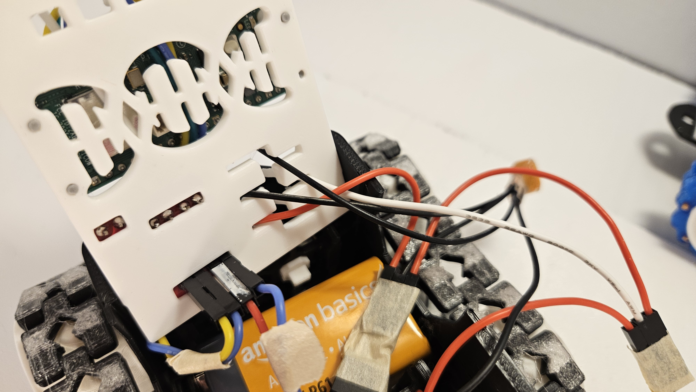

With the 4 power wires through the Pico plate, you can set plate on top of the chassis. Don't worry about snapping the Pico Plate in place. At this point, just let the Pico Plate rest on top of the chassis.

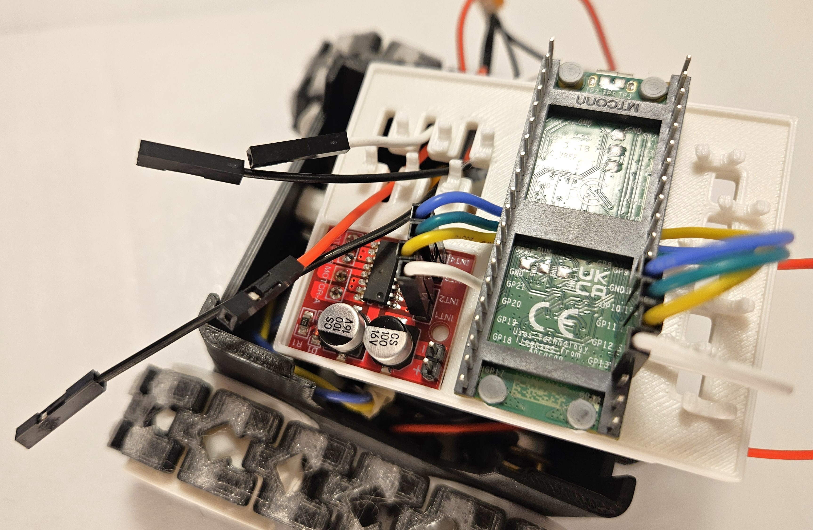

Now we will try to push the Pico Plate into is final recessed position on the chassis.  To do this, start by positioning the Pico Plate inside the top of the chassis.

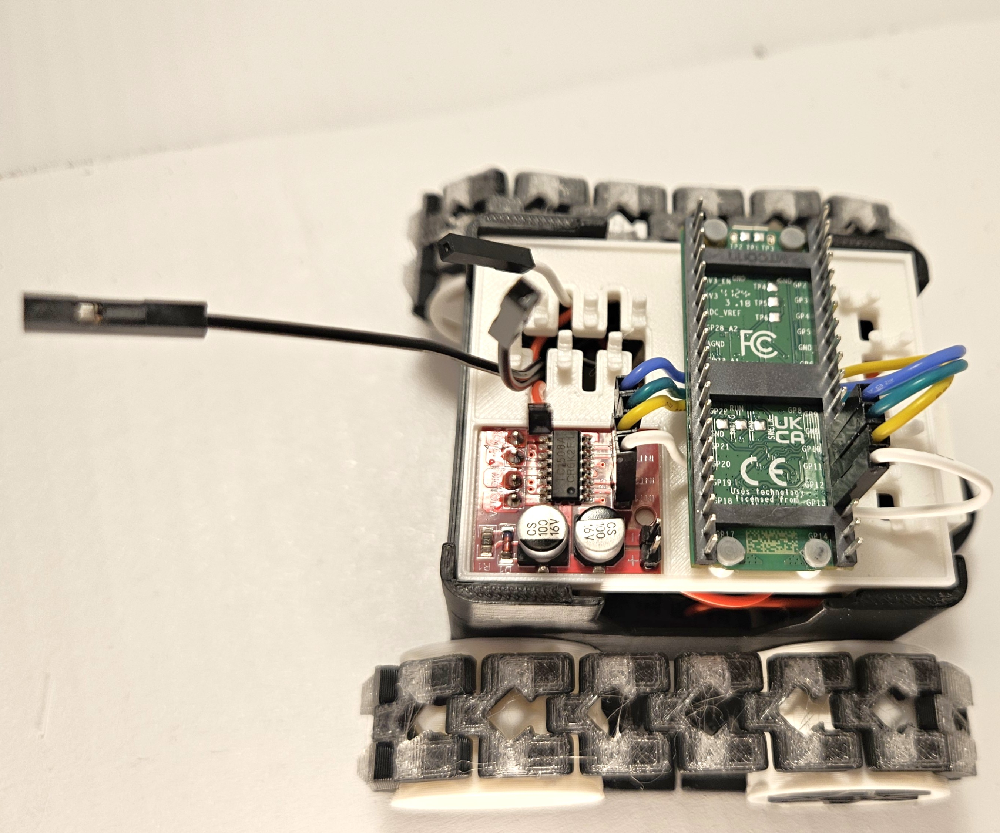

Carefully push the plate down onto the chassis.  Make sure that the wires aren't disconnected or pinched between the plate and chassis.  The plate should sit flush with the cutout in the front and rear of the chassis.

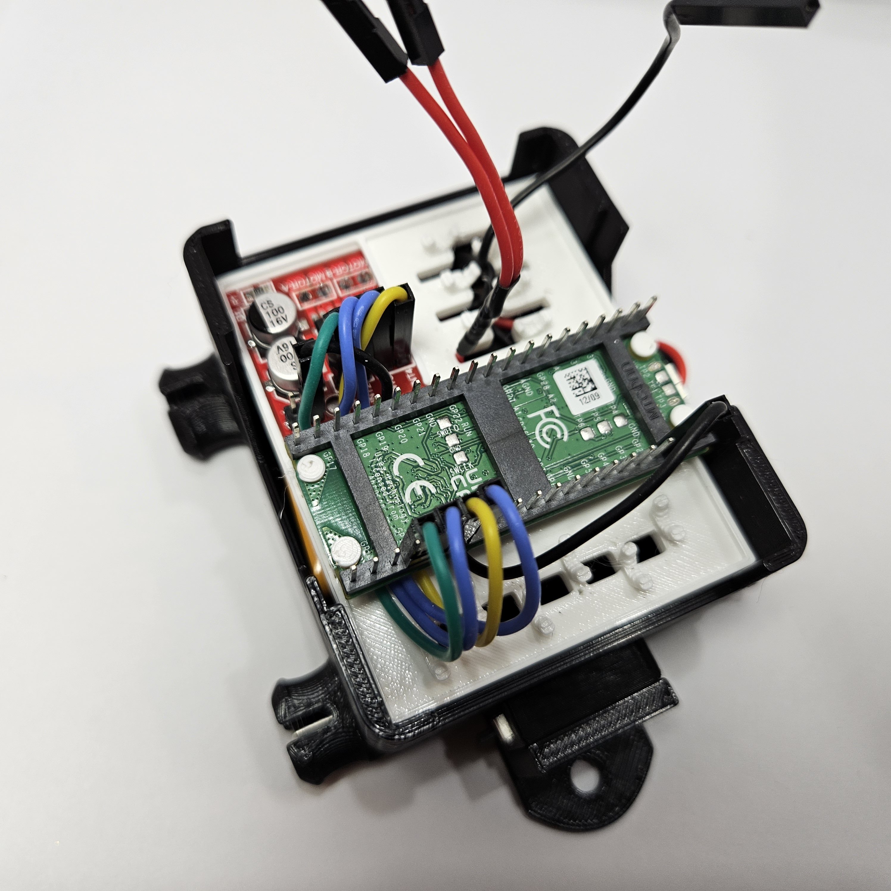

Now it's time to connect the power cables from the voltage regulator and battery to the Pico and motor controller.

Take the two red wires and connect one to the Pico's VSYS pin (left side, second down from the top in the below picture).  The other red wire goes to the (+) pin on the motor controller.  

Here's a pinout diagram if you want to use it instead of the pictures:  

 Click here to hide/show Pico Pin Out.
 
 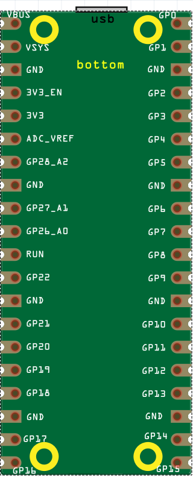

The ground/black wire goes to a ground pin on the Pico.  We recommend the ground pin right next to the VSYS.  That is 3 pins down from the top left in the picture.

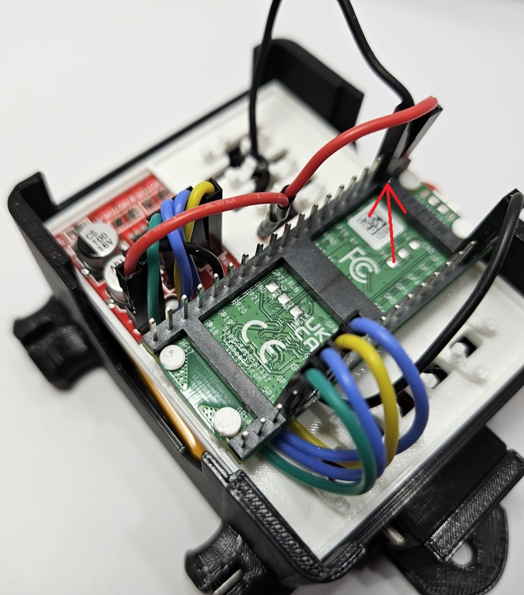

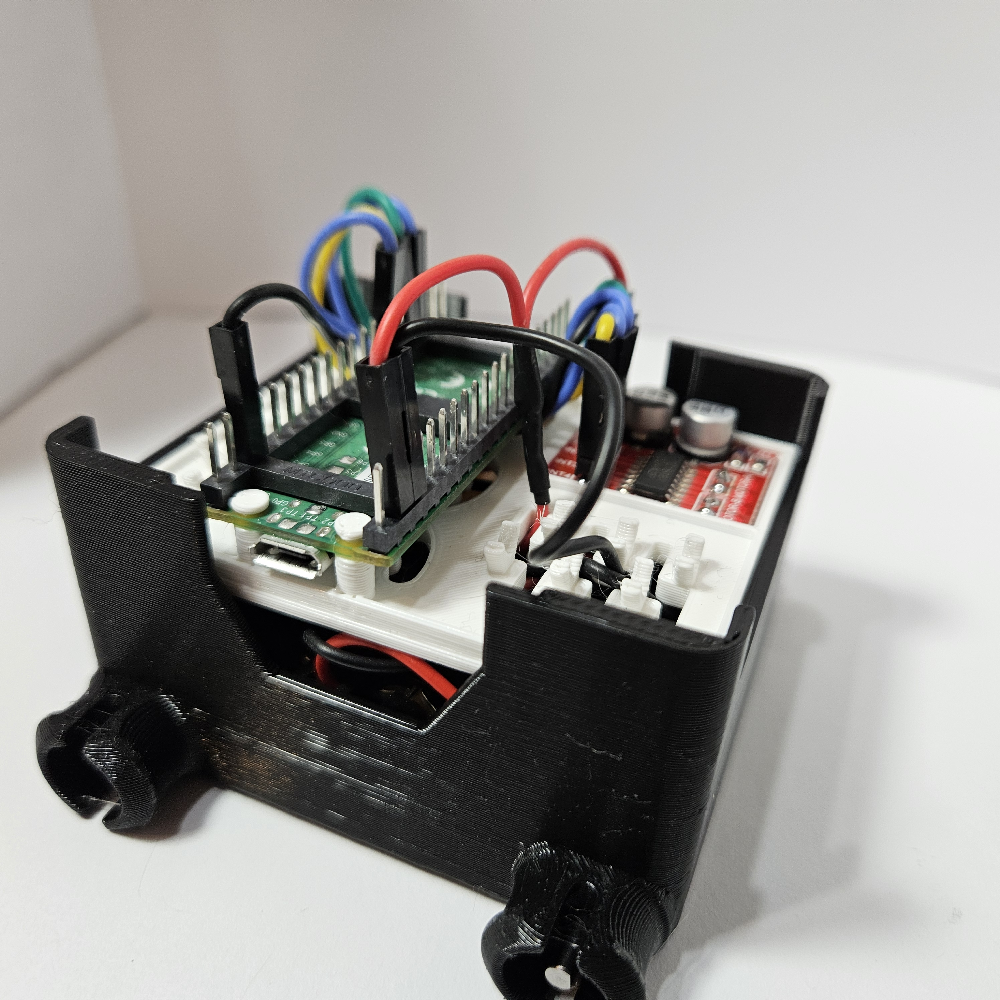

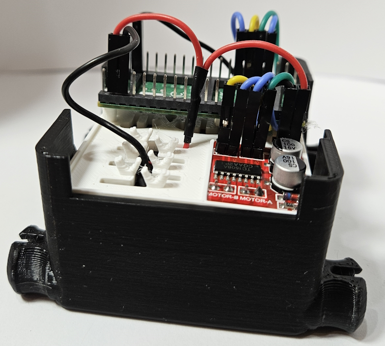

Congratulations! You are super close to having a mobile rover!

Actually, if you already have your wheels and tracks installed, you may want to go ahead and install the code and test out what you have built.

You should be able to install the code and use the mobile app to test the basic drivability of your rover.

- [Install Shark Code](/lessons/assembly/code_install.md)  
- [Mobile app](https://github.com/javaplus/mad_scientist_app/blob/main/README.md)

[back](https://github.com/javaplus/MadScientist/blob/main/lessons/assembly/power.md)                

[next](https://github.com/javaplus/MadScientist/blob/main/lessons/assembly/tail.md)
