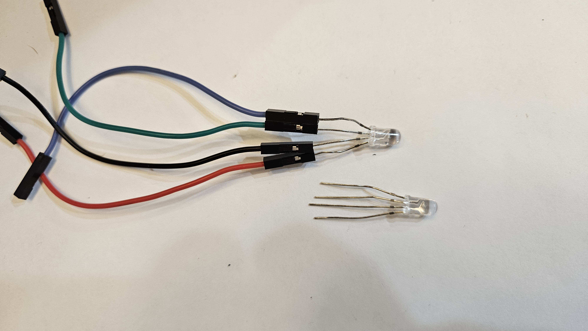
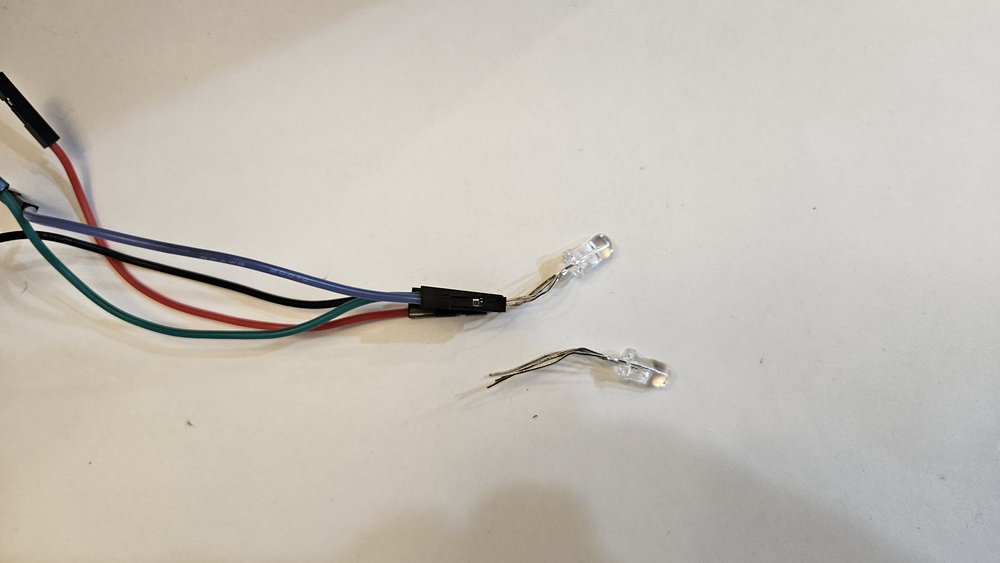
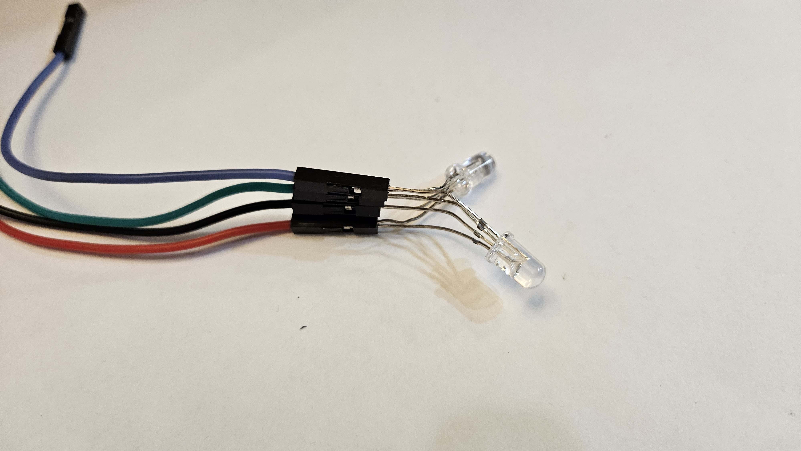
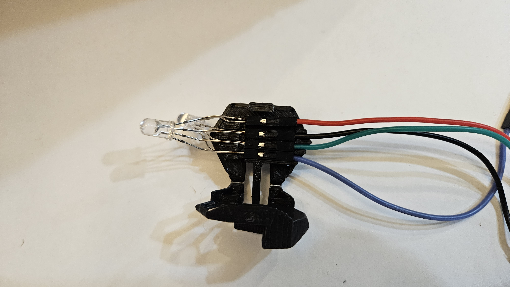
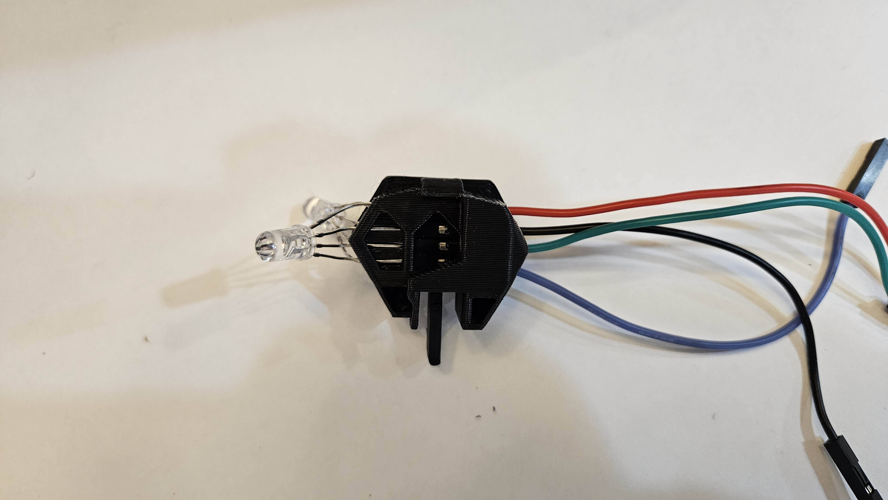

# LED Harness Assembly

## Parts Required

* **2x RGB LEDs (5mm):** These must be **Common Cathode** (where the long pin is Ground).
* **4x DuPont Wires (Female-to-Female or Female-to-Male):** Prepared to receive the LED pins.
* **Printed Harness Shell:** Two halves that snap together (part of the `head_parts` print).

*Visual: The disassembled harness shell, LEDs, and wires.*

---

## Assembly Steps

### 1. Identify LED Pinout
Before connecting anything, identify the pins on your RGB LEDs.
* The **Longest Pin** is the **Common Ground (Cathode)**.
* When holding the LED so the pins point down and the flat side of the lens is to the left, the order is generally: **Red, Common (Ground), Green, Blue**.

> **Note:** We are using **Common Cathode** LEDs. If you wire this up and the colors are inverted or don't work, verify your LED type.

### 2. Connect the Wires
We need to connect both LEDs to the same four wires (Parallel connection) so they light up in unison.

Make sure the slot order (left-to-right) matches: **red**, **black (ground)**, **green**, **blue**.

1.  **Group the Pins:** Align the two LEDs so their pins match (Red to Red, Ground to Ground, etc.).
2.  **Insert into Connectors:** Insert the corresponding pin pairs into the female ends of the DuPont wires.
    * All **Red** pins -> Red Wire
    * All **Ground** pins -> Black Wire
    * All **Green** pins -> Green Wire
    * All **Blue** pins -> Blue Wire
3.  *Tip:* Ensure the connection is snug. If using a specific connector housing (like in the image), push the pins in until they lock.

### 3. Seat in the Harness
1.  **Align the Junctions:** Take the lower half of the 3D printed harness.
2.  **Place the Wires:** Lay the metal connection points (where the LED pins enter the DuPont connectors) into the four grooves inside the harness shell.
    * The plastic housing of the DuPont wire should sit just outside or flush with the internal stops.
    * The LED bulbs should be sticking out of the front.

### 4. Close the Assembly
1.  **Snap Shut:** Take the top half of the harness shell and press it down onto the bottom half.
2.  **Secure:** Squeeze firmly until the harness snaps shut, locking the wires in place.

### 5. Final Adjustment
1.  **Bend the LEDs:** Gently pull the two LEDs slightly apart and angle them outward.
2.  **Aim:** The goal is to angle them so that when the harness is inserted into the shark head, the lights shine directly into the eye sockets.

*Visual: The completed harness with LEDs angled for the eyes.*

---

## Wiring to Pico

Now connect the female end of the wires to the Pico.

**Wiring (canonical for the head harness):** RED -> **GP22**, BLACK -> **GND**, GREEN -> **GP21**, BLUE -> **GP20**. See the image below which is a zoomed in view of the [overall wiring diagram](../images/overall_layout.PNG).

> **Note:** These mappings are the canonical head wiring — see the [Head assembly](head.md) for the head installation and final wiring table.

**Next Step:** Proceed to [Head Assembly](head.md) to install this harness into the rover.
