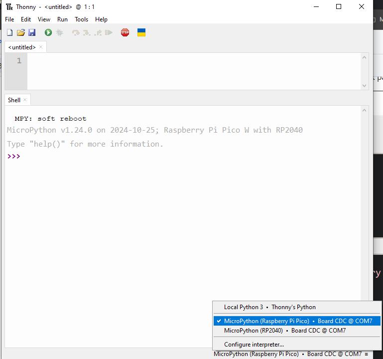

# First Time With the Pico!

## Overview

We will write our first bit of code in Python to run on the Pico and flash its onboard LED!  This is the obligatory blink demo for nearly all microcontroller projects... this is the equivalent of the "Hello world!" program.

## Raspberry Pi Pico WH

We are using the Raspberry Pi Pico WH which is part of the Raspberry Pi Foundation's new microcontroller family of boards... You can read more about them here.

[Official Pico Page](https://www.raspberrypi.com/products/raspberry-pi-pico/)

## Python

If this is your first time playing with Python you may find this cheatsheet helpful:

[Python Cheatsheet](https://www.pythoncheatsheet.org/)

 ## What to do

Connect your Raspberry Pi Pico to your computer via  USB cable and open Thonny.  If you don't have Thonny installed or haven't flashed the Pico to use Python follow this guide: [Thonny Setup](https://github.com/javaplus/MadScientist/blob/main/lessons/firmware.md)

In Thonny, go to the bottom right hand corner and choose the interpreter for Thonny to use.  If your computer recognized the Pico, you can choose the item that says "**MicroPython(Raspberry Pi Pico)** in the list. (see image below)



Note: if this is your first time launching Thonny you may have to click past the Welcome/language selection splash page.

If it's able to connect, you should see the Shell print a message like the one shown in the picture above that tells you the version of MicroPython running on the Pico.
The Shell is a [REPL](https://pythonprogramminglanguage.com/repl/) where you can type Python statements and have them be executed immediately.  We are not going to use the Shell.  Instead, we will type our code into the text editor area above the Shell.

Here is the obligatory blink demo for the Pico W (note that it's different for the standard Pico):

``` Python
from machine import Pin
import utime

led = Pin("LED", Pin.OUT)

while True:
    led.toggle()
    utime.sleep_ms(1000)
```
A note about the code above:

You'll notice that there is a `while True` statement at the end.

`while True` means loop forever. The `while` statement takes an expression and executes the loop body while the expression evaluates to boolean "true". `True` always evaluates to boolean "true" and thus executes the loop body indefinitely.

This is the section of the code that our Pico will run forever and ever, over and over again.  
(Unless we define a way for it to break out)

Enter the code above into the Thonny editor and then click the Play button.
If everything works, you should see the onboard LED flash green about once a second.

**NOTE** You can save this code to your Pico, by clicking the blue Save button in Thonny and then choosing to save it on the Pico.  Give it a file name and a ".py" extension.  If Thonny complains about the Pico or device being busy OR you think it's stuck processing somewhere, click the red STOP button to exit running the current program and then click Save. The STOP button resets the connection with the Pico. Once you have saved a file in Thonny, usually clicking the "Play" button will automatically save the latest version again as well as run it.  This may change with different releases of Thonny. So, if you need to save your code, click the Save button before closing Thonny to ensure a proper save.

If it works, eat a snack or better yet, give your instructor one!

